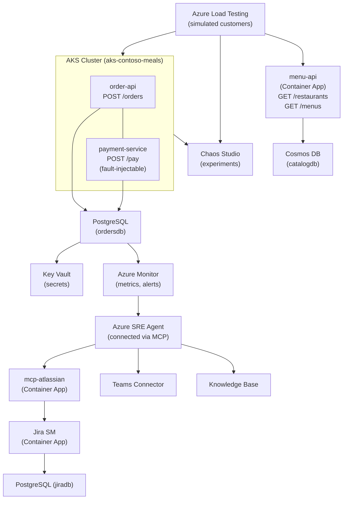
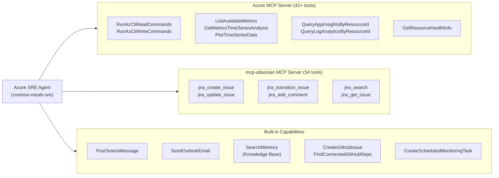
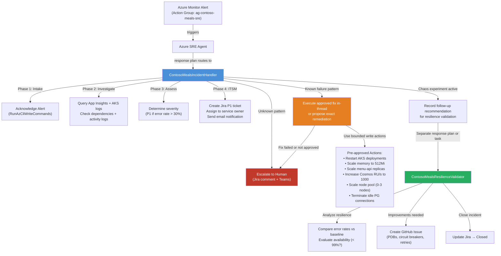
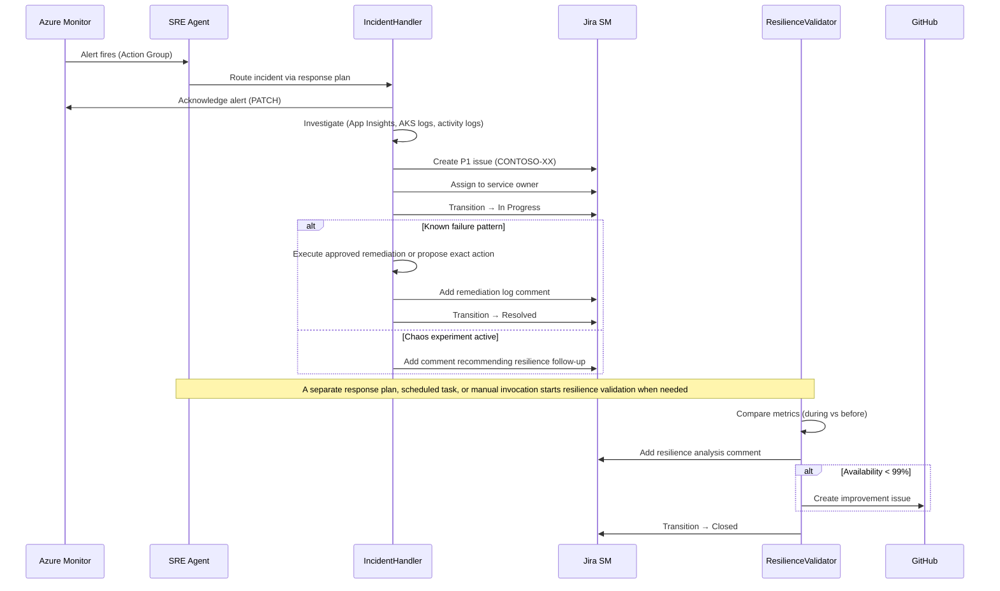

# Contoso Meals - Architecture & Deployment Guide

## Architecture Overview

The Contoso Meals platform is a cloud-native food ordering system deployed on Azure, designed to demonstrate Azure SRE Agent capabilities.

### Architecture Diagram



### Service Details

| Service | Host Type | Port | Data Store | Purpose |
|---------|-----------|------|------------|---------|
| order-api | AKS | 8080 | PostgreSQL (ordersdb) | Order lifecycle management |
| payment-service | AKS | 8080 | PostgreSQL (ordersdb) | Payment processing + fault injection |
| menu-api | Container App | 8080 | Cosmos DB (catalogdb) | Restaurant & menu catalog |
| jira-sm | Container App | 8080 | PostgreSQL (jiradb) | ITSM ticketing |
| mcp-atlassian | Container App | 9000 | N/A | MCP bridge to Jira |

### Azure Resources

| Resource | SKU/Tier | Region | Purpose |
|----------|---------|--------|---------|
| AKS Cluster | Automatic (Standard_DS4_v2) | Sweden Central | Hosts order-api + payment-service |
| Container App Environment | Consumption | Sweden Central | Hosts menu-api, jira-sm, mcp-atlassian |
| PostgreSQL Flexible Server | Standard_B1ms (Burstable) | Sweden Central | ordersdb + jiradb |
| Cosmos DB | Serverless | Sweden Central | catalogdb (restaurants, menus) |
| Key Vault | Standard | Sweden Central | Secrets management |
| Log Analytics | Per-GB | Sweden Central | Centralized logging |
| Load Testing | Standard | Sweden Central | Baseline + chaos load tests |
| Storage Account | Standard_LRS | Sweden Central | Jira home directory (Azure Files) |
| Chaos Studio | N/A | Sweden Central | Pod kill experiments |

### SRE Agent Configuration

The Azure SRE Agent (`Microsoft.App/agents@2025-05-01-preview`) is the autonomous operations layer. It connects to Azure resources via MCP (Model Context Protocol) servers, uses a knowledge base for runbooks, and routes incidents to the appropriate subagent through incident response plans and scheduled tasks.

#### Tool Connectors



| Connector | Type | Endpoint | Identity | Tools |
|-----------|------|----------|----------|-------|
| Azure MCP Server | MCP (streamable-http) | Built-in Azure integration | `id-contoso-meals-sre-agent` (User-Assigned MI) | 42+ Azure CLI, metrics, telemetry, health |
| mcp-atlassian | MCP (streamable-http) | `mcp-atlassian.*.azurecontainerapps.io:9000` | API token (Jira admin) | 34 Jira CRUD, workflow, search tools |
| Teams | Built-in | Microsoft Graph | Agent system identity | Post messages to channels |
| Outlook | Built-in | Microsoft Graph | Agent system identity | Send email notifications |
| Knowledge Base | Built-in | Agent memory store | Agent system identity | Semantic search over runbooks |

#### Response-Plan Routing Architecture

The SRE Agent uses incident response plans and scheduled follow-up tasks to route work to specialized subagents. Each subagent owns a bounded workflow and completes its work within a single thread instead of relying on downstream handoffs.



#### Subagent Details

| Subagent | Primary Use | Azure Tools | Jira Tools | Activation Model | Mode |
|----------|-------------|-------------|------------|------------------|------|
| **ContosoMealsIncidentHandler** | Diagnose incidents, create ITSM tickets, and either propose or execute approved fixes in-thread | `RunAzCliReadCommands`, `RunAzCliWriteCommands`, `QueryAppInsightsByResourceId`, `QueryLogAnalyticsByResourceId`, `SearchMemory` | `jira_create_issue`, `jira_update_issue`, `jira_transition_issue`, `jira_add_comment` | Incident response plan | Autonomous |
| **ContosoMealsAutoRemediator** | Execute pre-approved fixes for known patterns after triage is complete | `RunAzCliReadCommands`, `RunAzCliWriteCommands`, `GetResourceHealthInfo`, `CreateScheduledMonitoringTask` | `jira_add_comment`, `jira_transition_issue` + 30 more | Dedicated response plan, scheduled task, or manual invocation | Autonomous |
| **ContosoMealsResilienceValidator** | Post-incident resilience analysis and follow-up improvements | `RunAzCliReadCommands`, `QueryAppInsightsByResourceId`, `QueryLogAnalyticsByResourceId`, `CreateGithubIssue` | `jira_add_comment`, `jira_transition_issue` | Separate response plan, scheduled task, or manual invocation | Autonomous |
| **ContosoMealsHealthCheck** | Scheduled 24h anomaly detection | `RunAzCliReadCommands`, `GetMultipleTimeSeries`, `GetTimeSeriesAnalysis`, `QueryAppInsightsByResourceId` | — | Scheduled task | Autonomous |

#### Incident Lifecycle Flow



---

## Prerequisites

- Azure CLI 2.60+ (`az --version`)
- Bicep CLI (`az bicep version`)
- kubectl (`kubectl version --client`)
- An Azure subscription with Contributor access
- (Optional) Docker for local development

---

## Deployment Steps

### Step 1: Deploy Infrastructure

```bash
# Clone the repository
cd /path/to/azure-sre

# Deploy all Azure infrastructure via Bicep
az deployment sub create \
  --location swedencentral \
  --template-file infra/main.bicep \
  --parameters infra/main.parameters.json
```

This deploys: Resource Group, AKS, Container App Environment, PostgreSQL, Cosmos DB, Key Vault, Load Testing, Storage, Monitoring alerts, Chaos Studio, Jira SM, and mcp-atlassian.

**Deployment duration:** ~15-20 minutes.

### Step 2: Get AKS Credentials

AKS Automatic uses Entra ID RBAC (local accounts are disabled). Ensure you have the `Azure Kubernetes Service RBAC Cluster Admin` role assigned on the cluster before running:

```bash
az aks get-credentials \
  --resource-group rg-contoso-meals \
  --name aks-contoso-meals
```

### Step 3: Deploy Kubernetes Workloads

```bash
# Create namespace
kubectl apply -f manifests/namespace.yaml

# Create secrets (replace placeholders)
POSTGRES_FQDN=$(az deployment sub show \
  --name <deployment-name> \
  --query "properties.outputs.postgresServerFqdn.value" -o tsv)

kubectl create secret generic contoso-meals-secrets \
  --namespace production \
  --from-literal="orders-db-connection-string=Host=${POSTGRES_FQDN};Database=ordersdb;Username=contosoadmin;Password=P@ssw0rd1234!;SSL Mode=Require;Trust Server Certificate=true" \
  --from-literal="appinsights-connection-string=<your-app-insights-connection-string>"

# Deploy order-api and payment-service
# First update image references in manifests if using ACR
kubectl apply -f manifests/order-api.yaml
kubectl apply -f manifests/payment-service.yaml
```

### Step 4: Automated Deployment (Alternative)

```bash
# Use the deploy script for automated deployment
chmod +x scripts/deploy.sh
./scripts/deploy.sh
```

### Step 5: Verify Deployment

```bash
# Check all pods are running
kubectl get pods -n production

# Check services
kubectl get svc -n production

# Check Container Apps
az containerapp list --resource-group rg-contoso-meals -o table

# Test menu-api
MENU_FQDN=$(az containerapp show --name menu-api --resource-group rg-contoso-meals --query properties.configuration.ingress.fqdn -o tsv)
curl https://${MENU_FQDN}/health
curl https://${MENU_FQDN}/restaurants
```

### Step 6: Configure Jira

```bash
# Wait for Jira to initialize (first boot: 3-5 min)
./scripts/setup-jira.sh

# Complete the Jira setup wizard in browser if this is first boot
JIRA_FQDN=$(az containerapp show --name jira-sm --resource-group rg-contoso-meals --query properties.configuration.ingress.fqdn -o tsv)
echo "Open: https://${JIRA_FQDN}"
```

### Step 7: Run Baseline Load Test

```bash
# Generate 30 minutes of baseline traffic
./scripts/generate-load.sh 30

# Or configure Azure Load Testing in the portal with load-tests/*.jmx files
```

### Step 8: Create SRE Agent

Manual step in Azure Portal - see `demo-proposal.md` Part 1.

---

## Troubleshooting

### PostgreSQL "LocationIsOfferRestricted" Error

All resources are deployed to Sweden Central. If Sweden Central has capacity issues for PostgreSQL Flexible Server, try:
- `westeurope`
- `northeurope`
- `westus3`

Update `postgresLocation` in `infra/main.parameters.json`.

### Jira "Couldn't Connect to Database"

Checklist:
1. PostgreSQL is running: `az postgres flexible-server show --name psql-contoso-meals-db --resource-group rg-contoso-meals`
2. Firewall allows Azure services: Check for `AllowAllAzureServicesAndResourcesWithinAzureIps` rule
3. JDBC URL is correct: `jdbc:postgresql://psql-contoso-meals-db.postgres.database.azure.com:5432/jiradb?sslmode=require`
4. Credentials match: `contosoadmin` / `P@ssw0rd1234!`
5. jiradb database exists: `az postgres flexible-server db show --server-name psql-contoso-meals-db --resource-group rg-contoso-meals --database-name jiradb`

### AKS Pods Not Starting

```bash
kubectl describe pod -n production -l app=order-api
kubectl logs -n production -l app=order-api --tail=50
```

Common issues:
- Secret `contoso-meals-secrets` not created in `production` namespace
- Image pull errors (update image references in manifests)
- PostgreSQL connection refused (check firewall rules)

### Container App Not Starting

```bash
az containerapp logs show --name menu-api --resource-group rg-contoso-meals --tail 50
```

### SRE Agent MCP Connector Shows "Disconnected"

The Azure MCP connector requires a **user-assigned** managed identity. System-assigned identities are not supported for SRE Agent connectors.

**Checklist:**
1. **Identity exists:** `az identity show --name id-contoso-meals-sre-agent --resource-group rg-contoso-meals`
2. **Client ID is correct:** The `AZURE_CLIENT_ID` env var must match the identity's client ID:
   ```bash
   az identity show --name id-contoso-meals-sre-agent --resource-group rg-contoso-meals --query clientId -o tsv
   ```
3. **Identity selected in dropdown:** In the connector config, you must select `id-contoso-meals-sre-agent` from the **Managed Identity** dropdown — setting the env var alone is not enough.
4. **Reader role assigned:** The identity must have at least Reader on the resource group:
   ```bash
   az role assignment list --assignee $(az identity show --name id-contoso-meals-sre-agent -g rg-contoso-meals --query principalId -o tsv) --scope /subscriptions/<sub-id>/resourceGroups/rg-contoso-meals -o table
   ```
5. **`AZURE_TOKEN_CREDENTIALS`** must be set to exactly `ManagedIdentityCredential` (PascalCase, matching the .NET credential class name).
6. **Arguments format:** Arguments must be comma-separated: `-y, @azure/mcp, server, start`
7. **After fixing:** Delete and re-add the connector, then verify it shows **Connected**.

---

## Teardown

```bash
# Delete all resources
./scripts/teardown.sh

# Or manually
az group delete --name rg-contoso-meals --yes --no-wait
```

**Daily cost while running:** ~$20-35. Tear down after demo.
