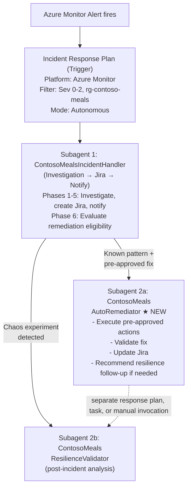
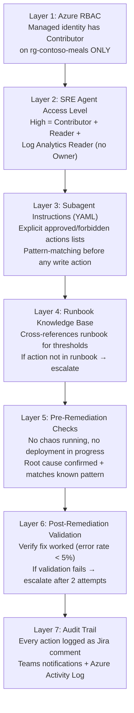
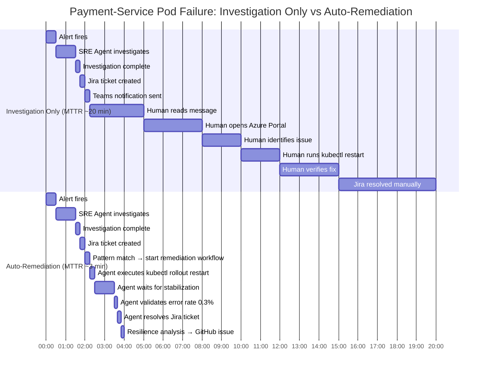

# Auto-Remediation Proposal: Contoso Meals × Azure SRE Agent

> **Document type:** Proposal & Implementation Guide
> **Date:** 2026-02-13
> **Application:** Contoso Meals — cloud-native food ordering platform
> **Prerequisite:** Existing Chaos Studio experiments + incident response automation (see `demo-proposal.md`, `incident-response-plan-research.md`)
> **Inspired by:** [microsoft/sre-agent — bicep-deployment samples](https://github.com/microsoft/sre-agent/blob/main/samples/bicep-deployment) and [incident automation samples](https://github.com/microsoft/sre-agent/blob/main/samples/automation/samples/01-incident-automation-sample.md)

---

## 1. Executive Summary

The current Contoso Meals demo demonstrates:

1. **Chaos experiments** (pod kill, network latency) via Azure Chaos Studio
2. **Autonomous investigation** by the SRE Agent (diagnose → Jira → Teams → GitHub issue)
3. **Human-in-the-loop remediation** — the agent never executes write actions

This proposal adds a **Part 5: Auto-Remediation** capability where the SRE Agent, operating in **Autonomous mode with High access level**, can execute pre-approved remediation actions when specific, well-understood failure patterns are detected — without waiting for human approval.

### Why Now?

| Current State | Proposed State |
|---------------|----------------|
| Agent investigates and documents findings | Agent investigates, documents, **and remediates** |
| Human reads Jira ticket, then manually acts | Agent remediates known patterns; alerts human for unknowns |
| Chaos experiment shows fragility | Chaos experiment **validates auto-remediation works** |
| Mean Time to Remediate (MTTR): 15-30 min (human) | MTTR: 1-3 min (autonomous agent) |

---

## 2. Architecture: The Remediation Subagent Pattern

### Key Design Principle: Separation of Concerns

Following the [context engineering lessons](https://techcommunity.microsoft.com/blog/appsonazureblog/context-engineering-lessons-from-building-azure-sre-agent/4481200) from the Azure SRE Agent team, we use a **response-plan routing model with bounded subagents** instead of a runtime handoff chain:



### When Does Auto-Remediation Activate?

The `ContosoMealsIncidentHandler` (Subagent 1) evaluates a **remediation decision matrix** after investigation:

| Condition | Action | Execution Path |
|-----------|--------|----------------|
| Known failure pattern + clear root cause + pre-approved fix | **Auto-remediate** | IncidentHandler executes in-thread if allowed, or route to `ContosoMealsAutoRemediator` via a dedicated response plan/task |
| Chaos experiment detected + no remediation needed | **Analyze resilience** | Trigger or recommend `ContosoMealsResilienceValidator` as a separate workflow |
| Unknown failure pattern OR multi-service cascade | **Alert human** | Stays in IncidentHandler, notifies Teams |
| Remediation failed after 2 attempts | **Escalate** | Page on-call, P1 Jira escalation |

---

## 3. Pre-Approved Remediation Scenarios for Contoso Meals

These are the **specific, bounded remediation actions** the agent is authorized to take autonomously. Each maps to a real failure mode surfaced by our Chaos Studio experiments.

### Scenario 1: Payment-Service Pod Failures (AKS)

**Trigger:** Alert `alert-pod-restart-contoso-meals` fires — payment-service pods in CrashLoopBackOff or killed

**Investigation confirms:** Pods are failing but the database is healthy and no deployment in progress

**Auto-remediation actions:**

```
Step 1: kubectl rollout restart deployment/payment-service -n production
Step 2: Wait 60 seconds
Step 3: kubectl get pods -n production -l app=payment-service (verify Running)
Step 4: Query App Insights — verify error rate < 5% over 2 minutes
```

**Runbook reference:** "If pods are OOMKilled, safe to increase limits to 512Mi without approval"

**Guardrails:**
- Maximum 2 restart attempts before escalating
- Will NOT restart if a Chaos Studio experiment is actively running (avoids fighting chaos)
- Will NOT restart if error is caused by a bad deployment (checks revision history first)

**SRE Agent tools used:** `RunAzCliWriteCommands` (for kubectl), `QueryAppInsightsByResourceId` (for validation)

---

### Scenario 2: Payment-Service Memory Pressure (AKS)

**Trigger:** Alert fires with OOMKilled events OR memory utilization > 90% on payment-service pods

**Investigation confirms:** Pods are OOMKilled, not caused by a memory leak (steady increase over time vs spike)

**Auto-remediation actions:**

```
Step 1: kubectl set resources deployment/payment-service -n production \
        --limits=memory=512Mi --requests=memory=256Mi
Step 2: kubectl rollout status deployment/payment-service -n production --timeout=120s
Step 3: Verify new pods are Running with updated limits
Step 4: Query App Insights — verify error rate returns to baseline
```

**Runbook reference:** "If pods are OOMKilled, safe to increase limits to 512Mi without approval"

**Guardrails:**
- Memory limit ceiling: 512Mi (runbook-approved maximum without human approval)
- If already at 512Mi and still OOMKilled → escalate to human
- Will NOT scale if the pattern looks like a memory leak (gradual increase over hours)

---

### Scenario 3: Menu-API Container App Scaling (Azure Container Apps)

**Trigger:** Alert for Cosmos DB 429 throttling OR menu-api response time > 3s

**Investigation confirms:** High read traffic on menu-api, Cosmos DB handling OK but Container App not scaling fast enough

**Auto-remediation actions:**

```
Step 1: az containerapp update --name menu-api --resource-group rg-contoso-meals \
        --min-replicas 3 --max-replicas 10
Step 2: Wait 90 seconds for new replicas to become ready
Step 3: Verify replica count increased via az containerapp show
Step 4: Query App Insights — verify P95 latency < 500ms
```

**Guardrails:**
- Maximum replicas: 10 (cost ceiling)
- Will NOT scale if root cause is Cosmos DB 429s (scale RU/s instead — requires human approval for cost reasons)
- Reverts scale-up after 30 minutes if traffic returns to normal (scheduled task or follow-up)

---

### Scenario 4: Cosmos DB Temporary RU/s Increase

**Trigger:** Alert `Cosmos DB 429 (throttled requests) > 0` fires

**Investigation confirms:** Legitimate traffic increase (correlates with load test or lunch rush), not a runaway query

**Auto-remediation actions:**

```
Step 1: az cosmosdb sql database throughput update \
        --account-name cosmos-contoso-meals --resource-group rg-contoso-meals \
        --name catalogdb --throughput 1000
Step 2: Wait 30 seconds
Step 3: Query Cosmos DB metrics — verify 429 rate drops to 0
Step 4: Schedule revert to 400 RU/s after 1 hour
```

**Runbook reference:** "If Cosmos DB shows 429 errors, increase RU/s temporarily (safe up to 1000 RU/s)"

**Guardrails:**
- Maximum RU/s ceiling: 1000 (runbook-approved)
- Will NOT increase beyond 1000 RU/s without human approval
- Automatically reverts after 1 hour (prevents cost overrun)
- Will NOT increase if the 429s are caused by a hot partition (flag for human review instead)

---

### Scenario 5: PostgreSQL Connection Exhaustion

**Trigger:** Alert `PostgreSQL active connections > 80%` fires

**Investigation confirms:** Connection count approaching limit, likely idle connections from previous pod restarts

**Auto-remediation actions:**

```
Step 1: Identify idle connections > 30 minutes via pg_stat_activity
Step 2: Terminate idle connections using pg_terminate_backend()
Step 3: Wait 30 seconds
Step 4: Re-check active connection percentage
```

**Runbook reference:** "Safe to terminate idle connections older than 30 minutes"

**Guardrails:**
- Only terminates connections idle for > 30 minutes (runbook-approved)
- Will NOT terminate active query connections
- If connection count doesn't drop after cleanup → escalate to human
- Requires the Azure MCP server to execute via `RunAzCliWriteCommands` with psql

---

## 4. The Auto-Remediation Subagent: Full YAML

### Subagent: `ContosoMealsAutoRemediator`

Navigate to **SRE Agent → Subagent Builder → Create → Subagent**

| Property | Value |
|----------|-------|
| **Name** | `ContosoMealsAutoRemediator` |
| **Instructions** | *(see YAML file)* |
| **Subagent Description** | `Use this subagent for known, pre-approved remediation patterns identified during incident triage. Executes bounded write actions and validates the fix.` |
| **Built-in Tools** | Azure CLI (read + write), Log Analytics, Application Insights |
| **MCP Tools** | Azure MCP (AKS, Container Apps, Cosmos DB, Monitor tools), mcp-atlassian (Jira tools) |
| **Activation** | Dedicated response plan, scheduled task, or manual invocation |
| **Knowledge Base** | Enable — link to uploaded runbooks |

> **YAML definition:** [`subagents/contoso-meals-auto-remediator.yaml`](../subagents/contoso-meals-auto-remediator.yaml)
>
> Paste the contents of that file into the **YAML tab** in Subagent Builder.

---

## 5. Required Changes to Existing Configuration

### 5.1 Update `ContosoMealsIncidentHandler` — Add Remediation Decision Logic

Add a new Phase 5 (Remediation Decision) to the existing incident handler subagent YAML (from `incident-response-plan-research.md`). **This is already included in the trimmed IncidentHandler instructions** — Phase 5 of the updated YAML contains the full remediation decision matrix:

- **A)** Known pattern + pre-approved fix → execute in-thread when allowed, or route to `ContosoMealsAutoRemediator` through a dedicated response plan/task
- **B)** Chaos experiment active → recommend or trigger `ContosoMealsResilienceValidator` as a separate follow-up workflow
- **C)** Unknown pattern → escalate to human via Jira + Teams

No runtime handoff list is required in the YAML. The routing decision now lives in response plans, scheduled tasks, and the subagent's own prompt logic.

### 5.2 SRE Agent Access Level: Must Be "High"

The auto-remediation subagent requires **write access** to Azure resources. Verify the SRE Agent is deployed with `accessLevel: 'High'` (Contributor role):

```bicep
// In infra/main.bicep — already configured
param sreAgentAccessLevel string = 'High'  // ← Required for auto-remediation
```

The `High` access level grants the managed identity these roles (from `sre-agent-role.bicep`):
- **Reader** — for investigation
- **Log Analytics Reader** — for querying metrics/logs
- **Contributor** — for executing write commands (restart, scale, update)

### 5.3 SRE Agent Mode: Autonomous

For full auto-remediation, the agent must be in **Autonomous** mode:

```bicep
param sreAgentMode string = 'Autonomous'  // Changed from 'Review'
```

> **For demo purposes:** You may keep the top-level agent in `Review` mode while configuring individual subagents (IncidentHandler, AutoRemediator) as `agent_type: Autonomous`. The incident trigger's processing mode controls whether the selected workflow runs autonomously.

### 5.4 Update Knowledge Base — Remediation Runbook

Add a new section to `knowledge/contoso-meals-runbook.md`:

```markdown
## Auto-Remediation Approved Actions

### Pre-Approved (Agent Can Execute Autonomously)
| Scenario | Action | Ceiling | Revert Policy |
|----------|--------|---------|---------------|
| Pod CrashLoopBackOff | kubectl rollout restart | 2 attempts | N/A |
| OOMKilled pods | Increase memory limit | 512Mi max | Manual review at 512Mi |
| menu-api slow | Scale Container App replicas | 10 replicas max | Scale down after 30 min |
| Cosmos DB 429s | Increase RU/s | 1000 RU/s max | Revert after 1 hour |
| PostgreSQL connections > 80% | Kill idle connections > 30 min | N/A | N/A |

### Requires Human Approval
- Any deletion of resources
- Memory limits beyond 512Mi (likely memory leak — needs code fix)
- Cosmos DB RU/s beyond 1000 (cost implications)
- Container App replicas beyond 10 (cost implications)
- Network or security changes
- Rollbacks to previous deployments
```

---

## 6. Demo Flow: Part 5 — "Self-Healing Under Fire"

This extends the existing 4-part demo with a new auto-remediation showcase.

### Scene 5.1: Setup — Switch to Autonomous Mode (2 min)

**Narrator:** *"Parts 1-4 showed the SRE Agent as a connected brain — investigating, documenting, and notifying. But what if the agent could also fix known problems? Let's enable auto-remediation."*

Show the audience:
1. Open **SRE Agent → Settings** — point out `accessLevel: High` (Contributor)
2. Open the **Incident Trigger** — switch from `Review` to `Autonomous`
3. Open **Subagent Builder** — show `ContosoMealsAutoRemediator` is configured

**Key talking point:** *"Auto-remediation is opt-in and bounded. The agent can only execute actions explicitly listed in the runbook. Anything outside the approved list — the agent stops and pages a human."*

### Scene 5.2: Start Load + Trigger Pod Failure (3 min)

```bash
# Start lunch rush traffic
./scripts/start-lunch-rush.sh --load-only

# Wait 60 seconds for baseline metrics, then kill payment-service pods
kubectl delete pod -n production -l app=payment-service
```

**Narrator:** *"We've just killed the payment-service pods during peak traffic. The alert will fire, and this time the agent won't just investigate — it will fix."*

### Scene 5.3: Watch the Autonomous Chain (8-10 min)

**What happens (visible across SRE Agent chat, Jira, and Teams):**

**Minute 0-1:** Alert fires → Incident trigger activates `ContosoMealsIncidentHandler`
- Agent creates Jira ticket: "Payment-service pod failures causing checkout errors"
- Agent starts investigating (AKS pods, App Insights, Activity Log)

**Minute 1-3:** Investigation complete → Remediation decision
- Agent posts to Jira: *"Investigation complete. Root cause: payment-service pods terminated. No chaos experiment running. No deployment in progress. Pattern matches pre-approved remediation: Pod Restart. Executing approved remediation workflow."*
- IncidentHandler executes the remediation in-thread, or a dedicated remediation workflow is triggered depending on the response-plan configuration

**Minute 3-4:** Auto-remediation executes
- Agent posts to Jira: *"🔧 Auto-remediation: Pre-check passed for Scenario 1 (Pod Failure). Current state: 0/2 pods Running. Executing: kubectl rollout restart deployment/payment-service -n production"*
- Agent executes the restart via `RunAzCliWriteCommands`
- Agent posts: *"🔧 Auto-remediation: Restart initiated. Waiting 60 seconds for stabilization."*

**Minute 4-5:** Validation
- Agent checks pods: *"All 2/2 pods Running"*
- Agent queries App Insights: *"Error rate dropped from 42% to 0.3%. P95 latency: 185ms (within baseline)."*
- Agent posts to Jira: *"🔧 Auto-remediation: Validation PASSED. Error rate: 0.3%, P95: 185ms. Remediation successful."*

**Minute 5-6:** Closure and follow-up recommendation
- Agent transitions Jira ticket to "Resolved" with full remediation log
- Agent sends Teams message: *"✅ Auto-remediation successful for payment-service. Error rate recovered from 42% to 0.3%. Jira: CONTOSO-47"*
- Recommends `ContosoMealsResilienceValidator` for post-incident analysis, or triggers it through a separate response plan/task if configured

**Minute 6-8:** Resilience analysis
- Validator creates GitHub issue: *"Add PodDisruptionBudget to payment-service to prevent simultaneous pod termination during peak traffic"*
- Updates Jira with resilience recommendations

**Narrator:** *"From alert to full recovery in under 5 minutes — with zero human involvement. The agent investigated, confirmed the pattern, executed the fix, validated success, documented everything in Jira, notified the team on Teams, and created a GitHub issue for a permanent fix. And it did all of this because the action was pre-approved in the runbook. If the pattern had been unknown, it would have stopped and paged a human."*

### Scene 5.4: Show the Safety Rails — Chaos Experiment Scenario (5 min)

Now demonstrate that the agent is NOT blindly remediating:

```bash
# Start a Chaos Studio experiment
az rest --method POST --url "https://management.azure.com/subscriptions/{sub}/resourceGroups/rg-contoso-meals/providers/Microsoft.Chaos/experiments/exp-contoso-meals-payment-incident/start?api-version=2024-01-01"
```

The alert fires again (pods being killed by chaos). Watch the agent:

1. `ContosoMealsIncidentHandler` investigates
2. Discovers an **active Chaos Studio experiment** in the Activity Log
3. Posts to Jira: *"Chaos Studio experiment detected (exp-contoso-meals-payment-incident). Auto-remediation skipped — this is expected behavior during chaos testing."*
4. **Triggers or recommends `ContosoMealsResilienceValidator`** instead of remediation

**Narrator:** *"Same failure, completely different response. The agent detected that a Chaos Studio experiment is running and deliberately skipped remediation. You don't want your auto-healer fighting your chaos engineer. The agent knows the difference."*

### Scene 5.5: Show the Escalation Path — Unknown Pattern (3 min)

Demonstrate the fallback for unknown scenarios. In the SRE Agent chat:

```
Simulate: The order-api is returning 503 errors but all pods are healthy, 
database connections are normal, and no chaos experiment is running. The error 
logs show "CERTIFICATE_EXPIRED" in the TLS handshake to an external payment 
gateway. Investigate and attempt remediation.
```

The agent will:
1. Investigate — finds healthy pods, normal DB, no chaos
2. Identifies root cause: expired certificate to external payment gateway
3. **Does NOT auto-remediate** — this is not a pre-approved pattern
4. Posts to Jira: *"⚠️ Unknown failure pattern detected: TLS certificate expired for external payment gateway. This is NOT a pre-approved auto-remediation scenario. Human intervention required."*
5. Sends Teams notification with P1 urgency

**Narrator:** *"The agent correctly identified this as outside its remediation authority. An expired external certificate requires human action — new cert procurement, gateway coordination. The agent investigated, documented everything, and escalated. That's the safety model."*

---

## 7. Infrastructure Changes

### 7.1 No Additional Bicep Required

The existing infrastructure already supports auto-remediation:

| Requirement | Already Deployed | Module |
|------------|-----------------|--------|
| SRE Agent with High access | ✅ `accessLevel: 'High'` | `sre-agent.bicep` |
| Contributor role on RG | ✅ `roleDefinitions.High` includes Contributor | `sre-agent-role.bicep` |
| Azure MCP with write commands | ✅ `RunAzCliWriteCommands` tool available | SRE Agent built-in |
| Alert rules for all scenarios | ✅ Pod restart, latency, error rate, connections | `monitoring.bicep` |
| Chaos Studio experiments | ✅ Pod kill, network latency | `chaos.bicep` |
| Jira integration | ✅ mcp-atlassian connector | `main.bicep` |

### 7.2 Optional: Add Cosmos DB Throughput Alert

Currently missing from `monitoring.bicep` — the Cosmos DB 429 alert for Scenario 4:

```bicep
// Add to modules/monitoring.bicep
resource cosmosThrottleAlert 'Microsoft.Insights/scheduledQueryRules@2023-03-15-preview' = {
  name: 'alert-cosmos-throttle-${prefix}'
  location: resourceGroup().location
  tags: tags
  properties: {
    displayName: 'Cosmos DB Throttled Requests (429) Detected'
    severity: 2
    enabled: true
    scopes: [logAnalyticsWorkspaceId]
    evaluationFrequency: 'PT1M'
    windowSize: 'PT5M'
    criteria: {
      allOf: [
        {
          query: 'AzureDiagnostics | where ResourceProvider == "MICROSOFT.DOCUMENTDB" | where statusCode_s == "429" | summarize ThrottleCount = count() by bin(TimeGenerated, 5m) | where ThrottleCount > 5'
          timeAggregation: 'Count'
          operator: 'GreaterThan'
          threshold: 0
        }
      ]
    }
    actions: {
      actionGroups: [actionGroup.id]
    }
  }
}
```

### 7.3 Optional: Add PostgreSQL Connection Alert

```bicep
// Add to modules/monitoring.bicep
resource postgresConnectionAlert 'Microsoft.Insights/metricAlerts@2018-03-01' = {
  name: 'alert-postgres-connections-${prefix}'
  location: 'global'
  tags: tags
  properties: {
    description: 'PostgreSQL active connections exceeding 80% of maximum'
    severity: 2
    enabled: true
    scopes: [postgresResourceId]
    evaluationFrequency: 'PT1M'
    windowSize: 'PT5M'
    criteria: {
      'odata.type': 'Microsoft.Azure.Monitor.SingleResourceMultipleMetricCriteria'
      allOf: [
        {
          name: 'HighConnectionCount'
          metricName: 'active_connections'
          operator: 'GreaterThan'
          threshold: 80
          timeAggregation: 'Average'
        }
      ]
    }
    actions: [
      { actionGroupId: actionGroupId }
    ]
  }
}
```

---

## 8. Safety & Governance

### 8.1 Defense in Depth



### 8.2 Rollback Strategy

| Scenario | Rollback Action | Who Executes |
|----------|----------------|--------------|
| Pod restart made things worse | `kubectl rollout undo deployment/<service> -n production` | **Human** — agent escalates |
| Memory increase didn't help | Reduce back to original limit | **Human** — agent documents original values |
| Container App over-scaled | `az containerapp update --min-replicas 1` | **Agent** — via scheduled task after 30 min |
| Cosmos DB RU/s not reverted | `az cosmosdb sql database throughput update --throughput 400` | **Agent** — via scheduled task after 1 hour |

### 8.3 Mode Progression (Recommended for Production)

| Phase | Duration | Agent Mode | Remediation Mode |
|-------|----------|-----------|-----------------|
| **Phase 1: Observe** | Weeks 1-2 | ReadOnly | None — agent only reads |
| **Phase 2: Advise** | Weeks 3-4 | Review | Agent suggests fixes, human approves |
| **Phase 3: Assist** | Weeks 5-8 | Autonomous (Subagent: Review) | Subagent proposes fix, human clicks approve |
| **Phase 4: Automate** | Week 9+ | Autonomous (Subagent: Autonomous) | Full auto-remediation for approved patterns |

---

## 9. Comparison: Investigation-Only vs Auto-Remediation

### Timeline: Payment-Service Pod Failure During Lunch Rush



### Business Impact Reduction

At 50 concurrent users during lunch rush (~0.5 successful orders/second):
- **Investigation only:** ~600 failed orders, ~$12,000 lost revenue (at $20 avg order)
- **Auto-remediation:** ~90 failed orders, ~$1,800 lost revenue
- **Savings per incident:** ~$10,200 and ~17 minutes of engineering time

---

## 10. Demo Script Checklist

### Pre-Demo Configuration

- [ ] `ContosoMealsAutoRemediator` subagent created with full YAML
- [ ] `ContosoMealsIncidentHandler` updated with Phase 6 (remediation decision)
- [ ] Incident trigger set to **Autonomous** mode
- [ ] SRE Agent access level verified as **High**
- [ ] Runbook updated with auto-remediation approved actions
- [ ] Baseline load test run (30+ minutes of metrics)
- [ ] Browser tabs ready: SRE Agent chat, Jira board, Teams channel, AKS pods

### Live Demo Steps

1. **Show configuration** — Autonomous mode, High access, approved actions list (2 min)
2. **Start load test** — `./scripts/start-lunch-rush.sh --load-only` (1 min)
3. **Trigger failure** — `kubectl delete pod -l app=payment-service -n production` (1 min)
4. **Watch autonomous workflow** — Alert → Investigate → Jira → Remediate → Validate → Resolve (5-8 min)
5. **Show safety rails** — Start chaos experiment, watch agent skip remediation (5 min)
6. **Show escalation** — Simulate unknown pattern, watch agent escalate to human (3 min)

### Key Talking Points

1. *"Auto-remediation is bounded by the runbook — the agent can only do what you've pre-approved"*
2. *"Every action is logged in Jira before and after — full audit trail"*
3. *"The agent knows not to fight chaos experiments — it was designed for chaos engineering workflows"*
4. *"Unknown patterns always escalate to humans — the agent knows what it doesn't know"*
5. *"MTTR dropped from 20 minutes to 3 minutes — that's 600 fewer failed orders during lunch rush"*

---

## 11. Key References

| Resource | URL |
|----------|-----|
| SRE Agent Bicep Deployment | https://github.com/microsoft/sre-agent/blob/main/samples/bicep-deployment |
| Incident Automation Sample (Octopets) | https://github.com/microsoft/sre-agent/blob/main/samples/automation/samples/01-incident-automation-sample.md |
| PD Error Handler Subagent YAML | https://github.com/microsoft/sre-agent/blob/main/samples/automation/subagents/pd-azure-resource-error-handler.yaml |
| Configure SRE Agent Guide | https://github.com/microsoft/sre-agent/blob/main/samples/automation/configuration/00-configure-sre-agent.md |
| Subagent Builder Overview | https://learn.microsoft.com/en-us/azure/sre-agent/subagent-builder-overview |
| Subagent Builder Scenarios | https://learn.microsoft.com/en-us/azure/sre-agent/subagent-builder-scenarios |
| Context Engineering Lessons | https://techcommunity.microsoft.com/blog/appsonazureblog/context-engineering-lessons-from-building-azure-sre-agent/4481200 |
| Azure Chaos Studio Docs | https://learn.microsoft.com/en-us/azure/chaos-studio/ |
| RunAzCliWriteCommands Tool | SRE Agent built-in tool — enables az CLI write operations |
