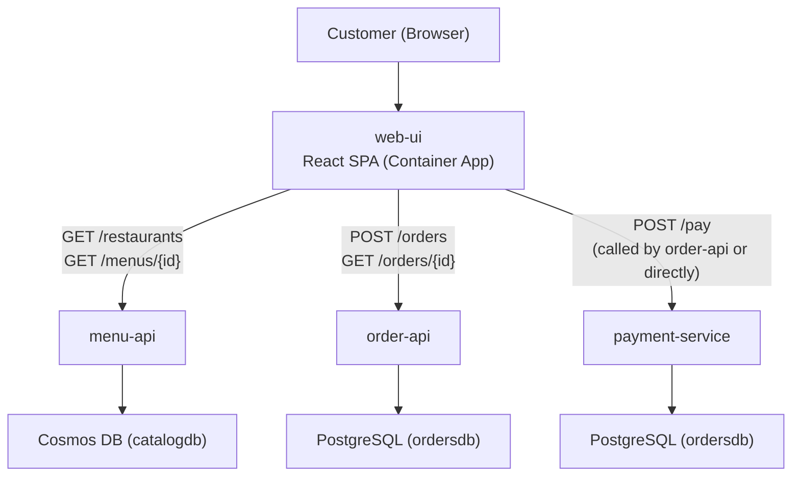

# Contoso Meals — Feature Specification

> **Source of truth:** `demo-proposal.md`
> **Application theme:** Cloud-native food ordering platform
> **Tech stack:** .NET 9 Minimal APIs, React (proposed), PostgreSQL, Cosmos DB, AKS, Container Apps
> **Last updated:** 2026-02-11

---

## Table of Contents

1. [Services Overview](#1-services-overview)
2. [API Capabilities — Existing](#2-api-capabilities--existing)
3. [API Capabilities — Proposed](#3-api-capabilities--proposed)
4. [UI Capabilities — Proposed](#4-ui-capabilities--proposed)
5. [Suggested Features](#5-suggested-features)
6. [Data Models](#6-data-models)
7. [Cross-Cutting Concerns](#7-cross-cutting-concerns)
8. [Demo Scenarios Enabled](#8-demo-scenarios-enabled)
9. [Deployment Architecture](#9-deployment-architecture)
10. [Implementation Priority](#10-implementation-priority)

---

## 1. Services Overview

| Service | Host | Port | Data Store | Purpose | Status |
|---------|------|------|------------|---------|--------|
| order-api | AKS (production namespace) | 8080 | PostgreSQL (ordersdb) | Order lifecycle management | **Implemented** |
| payment-service | AKS (production namespace) | 8080 | PostgreSQL (ordersdb) | Payment processing with fault injection | **Implemented** |
| menu-api | Container App | 8080 | Cosmos DB (catalogdb) | Restaurant & menu catalog | **Implemented** |
| web-ui | Container App (proposed) | 3000 | — (consumes APIs) | Customer-facing web application | **Proposed** |

### Architecture Flow



---

## 2. API Capabilities — Existing

These endpoints are implemented and functional in the current codebase.

### 2.1 menu-api (Restaurant & Menu Catalog)

**Host:** Container App | **Data Store:** Cosmos DB (catalogdb) | **Source:** `app/menu-api/`

| Method | Path | Description | Partition Key Used |
|--------|------|-------------|-------------------|
| GET | `/health` | Liveness probe — returns 200 + timestamp | — |
| GET | `/ready` | Readiness probe — checks Cosmos DB connectivity | — |
| GET | `/restaurants` | List all restaurants. Optional query: `?city=Seattle` | `/city` (when filtered) |
| GET | `/restaurants/{id}` | Get restaurant by ID. Optional query: `?city=Seattle` for direct partition read | `/city` (when provided) |
| POST | `/restaurants` | Create a restaurant (used for seeding) | `/city` |
| GET | `/menus/{restaurantId}` | Get full menu for a restaurant | `/restaurantId` |
| GET | `/menus/{restaurantId}/items` | Get menu items array only | `/restaurantId` |
| POST | `/menus` | Create a menu (used for seeding) | `/restaurantId` |

**Seed Data:** 4 restaurants across 3 cities (Seattle, Portland, San Francisco) with full menus auto-seeded on startup.

**Request/Response Examples:**

```
GET /restaurants?city=Seattle

Response 200:
[
  {
    "id": "restaurant-1",
    "name": "Contoso Burger Palace",
    "city": "Seattle",
    "cuisine": "American",
    "rating": 4.5,
    "address": "123 Pike Street, Seattle, WA 98101",
    "isOpen": true
  }
]
```

```
GET /menus/restaurant-1

Response 200:
{
  "id": "menu-1",
  "restaurantId": "restaurant-1",
  "items": [
    {
      "name": "Classic Burger",
      "price": 12.99,
      "category": "Burgers",
      "description": "Angus beef patty with lettuce, tomato, and special sauce"
    }
  ],
  "lastUpdated": "2025-01-15T10:00:00Z"
}
```

### 2.2 order-api (Order Management Service)

**Host:** AKS (production namespace) | **Data Store:** PostgreSQL (ordersdb) | **Source:** `app/order-api/`

| Method | Path | Description |
|--------|------|-------------|
| GET | `/health` | Liveness probe — returns `{ status: "healthy" }` |
| GET | `/ready` | Readiness probe — checks PostgreSQL connectivity |
| GET | `/orders` | List recent 50 orders (ordered by `created_at` DESC) |
| GET | `/orders/{id}` | Get order by UUID |
| POST | `/orders` | Create a new order |
| PUT | `/orders/{id}/status` | Update order status |

**Order Statuses:** `pending` → `confirmed` → `preparing` → `ready` → `delivered`

**Request/Response Examples:**

```
POST /orders
Content-Type: application/json

{
  "customerId": "00000000-0000-0000-0000-000000000001",
  "restaurantId": "restaurant-1",
  "items": [
    { "name": "Classic Burger", "price": 12.99, "quantity": 2 },
    { "name": "Truffle Fries", "price": 7.99, "quantity": 1 }
  ],
  "totalAmount": 33.97
}

Response 201:
{
  "id": "a1b2c3d4-...",
  "customerId": "00000000-0000-0000-0000-000000000001",
  "restaurantId": "restaurant-1",
  "status": "pending",
  "totalAmount": 33.97,
  "items": "[...]",
  "createdAt": "2025-01-15T12:00:00Z",
  "updatedAt": "2025-01-15T12:00:00Z"
}
```

```
PUT /orders/{id}/status
Content-Type: application/json

{ "status": "confirmed" }

Response 200: (updated order object)
```

**Seed Data:** One default customer (`Default Customer`, `default@contosomeals.com`) auto-created on startup.

### 2.3 payment-service (Payment Processing)

**Host:** AKS (production namespace) | **Data Store:** PostgreSQL (ordersdb) | **Source:** `app/payment-service/`

| Method | Path | Description |
|--------|------|-------------|
| GET | `/health` | Liveness probe |
| GET | `/ready` | Readiness probe — checks PostgreSQL connectivity |
| POST | `/pay` | Process a payment |
| GET | `/payments/{orderId}` | Get all payments for an order (most recent first) |
| POST | `/fault/enable` | Enable fault injection — `{ "rate": 50 }` for 50% failure |
| POST | `/fault/disable` | Disable fault injection |
| GET | `/fault/status` | Get current fault injection state |

**Payment Statuses:** `pending` → `processing` → `completed` | `failed`

**Request/Response Examples:**

```
POST /pay
Content-Type: application/json

{
  "orderId": "a1b2c3d4-...",
  "amount": 33.97,
  "paymentMethod": "credit_card"
}

Response 200 (success):
{
  "paymentId": "x1y2z3-...",
  "orderId": "a1b2c3d4-...",
  "amount": 33.97,
  "status": "completed",
  "processedAt": "2025-01-15T12:00:05Z"
}

Response 500 (fault injected):
{
  "error": "Payment gateway timeout",
  "paymentId": "x1y2z3-...",
  "status": "failed"
}
```

**Fault Injection (Demo Feature):**
- `POST /fault/enable` with `{"rate": 50}` — 50% of `/pay` requests return HTTP 500
- `POST /fault/disable` — returns to normal operation
- Fault state is in-memory; resets on pod restart
- Simulates real-world payment gateway failures for SRE Agent demos

---

## 3. API Capabilities — Proposed

These endpoints do not exist yet and are proposed to make the application more realistic for the demo and to support the UI.

### 3.1 menu-api Enhancements

| Method | Path | Description | Priority |
|--------|------|-------------|----------|
| GET | `/restaurants/search?q={query}` | Search restaurants by name, cuisine, or city | P1 |
| PUT | `/restaurants/{id}` | Update restaurant details (e.g., toggle `isOpen`) | P2 |
| GET | `/menus/{restaurantId}/items?category={cat}` | Filter menu items by category | P2 |
| PUT | `/menus/{restaurantId}` | Update a menu (add/remove items) | P2 |
| DELETE | `/restaurants/{id}` | Remove a restaurant | P3 |

**F-MENU-1: Restaurant Search**

Search restaurants by name, cuisine type, or city with partial matching.

```
GET /restaurants/search?q=burger
GET /restaurants/search?q=Japanese&city=Seattle

Response 200:
[
  {
    "id": "restaurant-1",
    "name": "Contoso Burger Palace",
    "city": "Seattle",
    "cuisine": "American",
    "rating": 4.5,
    "address": "123 Pike Street, Seattle, WA 98101",
    "isOpen": true
  }
]
```

Implementation notes:
- Use Cosmos DB SQL query with `CONTAINS()` for partial matching
- Support combined filters: `q` (name/cuisine fuzzy), `city` (exact partition key)
- When `city` is provided, scope to partition for efficient query

**F-MENU-2: Update Restaurant**

Allow toggling restaurant open/closed status and updating details.

```
PUT /restaurants/{id}
Content-Type: application/json

{
  "city": "Seattle",
  "isOpen": false
}

Response 200: (updated restaurant object)
```

Implementation notes:
- Requires `city` in body for partition key targeting
- Use Cosmos DB `ReplaceItemAsync` with partition key

### 3.2 order-api Enhancements

| Method | Path | Description | Priority |
|--------|------|-------------|----------|
| GET | `/orders?customerId={id}` | Filter orders by customer | P1 |
| GET | `/orders?status={status}` | Filter orders by status | P1 |
| GET | `/orders/{id}/details` | Get order with resolved restaurant name and payment status | P1 |
| POST | `/customers` | Register a new customer | P1 |
| GET | `/customers/{id}` | Get customer details | P1 |
| GET | `/customers` | List customers | P2 |
| DELETE | `/orders/{id}` | Cancel a pending order | P2 |
| GET | `/orders/stats` | Order statistics (count by status, avg amount, recent volume) | P3 |

**F-ORDER-1: Order Filtering**

Support filtering orders by customer and/or status.

```
GET /orders?customerId=00000000-0000-0000-0000-000000000001&status=pending

Response 200:
[
  {
    "id": "a1b2c3d4-...",
    "customerId": "00000000-...",
    "restaurantId": "restaurant-1",
    "status": "pending",
    "totalAmount": 33.97,
    "items": "[...]",
    "createdAt": "2025-01-15T12:00:00Z",
    "updatedAt": "2025-01-15T12:00:00Z"
  }
]
```

Implementation notes:
- Add query parameter binding to existing `/orders` endpoint
- Use EF Core `IQueryable` filtering before `Take(50)`

**F-ORDER-2: Enriched Order Details**

Return order with restaurant name (from menu-api) and payment status (from payment-service).

```
GET /orders/{id}/details

Response 200:
{
  "id": "a1b2c3d4-...",
  "customerId": "00000000-...",
  "customerName": "Default Customer",
  "restaurantId": "restaurant-1",
  "restaurantName": "Contoso Burger Palace",
  "status": "pending",
  "totalAmount": 33.97,
  "items": [
    { "name": "Classic Burger", "price": 12.99, "quantity": 2 }
  ],
  "paymentStatus": "completed",
  "createdAt": "2025-01-15T12:00:00Z",
  "updatedAt": "2025-01-15T12:00:00Z"
}
```

Implementation notes:
- order-api calls menu-api (HTTP) to resolve restaurant name
- order-api calls payment-service (HTTP) to get latest payment status
- Use `IHttpClientFactory` for inter-service calls
- This creates the cross-service dependency chain valuable for SRE Agent demos

**F-ORDER-3: Customer Management**

CRUD endpoints for customer registration.

```
POST /customers
Content-Type: application/json

{
  "name": "Jane Smith",
  "email": "jane@example.com"
}

Response 201:
{
  "id": "b2c3d4e5-...",
  "name": "Jane Smith",
  "email": "jane@example.com",
  "createdAt": "2025-01-15T12:00:00Z"
}
```

**F-ORDER-4: Cancel Order**

Cancel an order only if status is `pending`.

```
DELETE /orders/{id}

Response 200: { "id": "...", "status": "cancelled" }
Response 409: { "error": "Order cannot be cancelled", "currentStatus": "preparing" }
```

Implementation notes:
- Only allow cancellation for `pending` orders
- Set status to `cancelled` (soft delete, row remains)
- If payment exists, this should trigger a refund flow (future)

### 3.3 payment-service Enhancements

| Method | Path | Description | Priority |
|--------|------|-------------|----------|
| POST | `/pay/{paymentId}/refund` | Refund a completed payment | P2 |
| GET | `/payments/stats` | Payment statistics (success rate, total volume, avg amount) | P3 |

**F-PAY-1: Refund Processing**

Process a refund for a completed payment.

```
POST /pay/{paymentId}/refund

Response 200:
{
  "paymentId": "x1y2z3-...",
  "orderId": "a1b2c3d4-...",
  "amount": 33.97,
  "status": "refunded",
  "processedAt": "2025-01-15T12:05:00Z"
}

Response 409:
{ "error": "Payment is not in 'completed' status", "currentStatus": "failed" }
```

Implementation notes:
- Only `completed` payments can be refunded
- Create a new payment record with status `refunded` (audit trail)
- The refund payment references the same `orderId`

### 3.4 Cross-Service API: Order Orchestration Flow

**F-ORCH-1: End-to-End Order Placement**

Currently, the three services are independent — the client must call them separately. A more realistic flow has order-api orchestrate payment after order creation.

Proposed behavior change for `POST /orders`:
1. Client sends order to order-api
2. order-api creates order record (status: `pending`)
3. order-api calls `POST payment-service/pay` with order ID and amount
4. If payment succeeds → order status updated to `confirmed`
5. If payment fails → order status updated to `payment_failed`
6. Response includes both order and payment result

```
POST /orders
Content-Type: application/json

{
  "customerId": "00000000-0000-0000-0000-000000000001",
  "restaurantId": "restaurant-1",
  "items": [
    { "name": "Classic Burger", "price": 12.99, "quantity": 2 }
  ],
  "totalAmount": 33.97,
  "paymentMethod": "credit_card"
}

Response 201 (payment succeeded):
{
  "order": {
    "id": "a1b2c3d4-...",
    "status": "confirmed",
    "totalAmount": 33.97
  },
  "payment": {
    "paymentId": "x1y2z3-...",
    "status": "completed"
  }
}

Response 201 (payment failed):
{
  "order": {
    "id": "a1b2c3d4-...",
    "status": "payment_failed",
    "totalAmount": 33.97
  },
  "payment": {
    "paymentId": "x1y2z3-...",
    "status": "failed",
    "error": "Payment gateway timeout"
  }
}
```

**Demo value:** This creates a realistic service dependency chain. When payment-service pods are killed by Chaos Studio, the SRE Agent can trace the failure from order creation through to payment failure — showing cross-service impact.

Implementation notes:
- Use `IHttpClientFactory` with named client `payment-service`
- Service URL via environment variable `PaymentService__BaseUrl`
- Add timeout and basic retry (1 retry, 2s timeout) for resilience
- Add new order status: `payment_failed`

---

## 4. UI Capabilities — Proposed

The current application has no frontend. A customer-facing web UI would make the demo more visually compelling and provide realistic traffic patterns for Azure Load Testing.

### 4.1 Technology Choice

| Option | Recommendation |
|--------|----------------|
| **Framework** | React 18+ with TypeScript |
| **Build tool** | Vite |
| **Styling** | Tailwind CSS |
| **Hosting** | Azure Container App (alongside menu-api) |
| **Routing** | React Router v6 |

Rationale: React + Vite is lightweight, fast to build, and runs as a static SPA served from a Container App. No server-side rendering needed — all data comes from the existing APIs.

### 4.2 UI Pages and Components

#### Page: Home / Restaurant Listing

**Route:** `/`

**Description:** Landing page showing available restaurants with filtering by city and cuisine.

**Components:**
- `RestaurantCard` — Shows restaurant name, cuisine, rating (stars), city, open/closed badge
- `CityFilter` — Dropdown or tab bar for city selection (Seattle, Portland, San Francisco)
- `SearchBar` — Text input filtering restaurants by name or cuisine
- `RestaurantGrid` — Responsive grid layout for restaurant cards

**API calls:**
- `GET /restaurants` — on initial load
- `GET /restaurants?city=Seattle` — when city filter selected

**Behavior:**
- Default view shows all restaurants across cities
- Selecting a city filters in real-time via API call
- Clicking a restaurant card navigates to the menu page
- Closed restaurants show a "Currently Closed" overlay (greyed out, not clickable)

**Wireframe:**
```
┌─────────────────────────────────────────────┐
│  🍔 Contoso Meals                           │
│  [Search restaurants...]                    │
│  [All Cities] [Seattle] [Portland] [SF]     │
├─────────────────────────────────────────────┤
│  ┌──────────┐  ┌──────────┐  ┌──────────┐  │
│  │ Contoso  │  │ Fabrikam │  │ Northwind│  │
│  │ Burger   │  │ Sushi    │  │ Pizza    │  │
│  │ Palace   │  │ Bar      │  │ Co       │  │
│  │ ★★★★½    │  │ ★★★★★    │  │ ★★★★     │  │
│  │ American │  │ Japanese │  │ Italian  │  │
│  │ Seattle  │  │ Seattle  │  │ Portland │  │
│  └──────────┘  └──────────┘  └──────────┘  │
└─────────────────────────────────────────────┘
```

#### Page: Restaurant Menu

**Route:** `/restaurants/{restaurantId}`

**Description:** Menu page for a single restaurant with categorized items and an order builder.

**Components:**
- `RestaurantHeader` — Restaurant name, cuisine, rating, address, open status
- `MenuCategoryTabs` — Horizontal tabs for menu categories (Burgers, Sides, Drinks, etc.)
- `MenuItemCard` — Item name, description, price, "Add to Order" button with quantity selector
- `OrderSummary` — Sticky sidebar or bottom drawer showing current order items, quantities, subtotal

**API calls:**
- `GET /restaurants/{id}?city=...` — restaurant details
- `GET /menus/{restaurantId}` — full menu with items

**Behavior:**
- Menu items grouped by `category` field
- "Add to Order" adds item to local cart state (no API call yet)
- Quantity adjustable with +/– buttons
- Order summary shows running total
- "Place Order" button navigates to checkout
- If restaurant is closed, show menu as read-only with "Currently Closed" banner

**Wireframe:**
```
┌─────────────────────────────────────────────┐
│  ← Back    Contoso Burger Palace            │
│  American · ★★★★½ · 123 Pike St, Seattle   │
├─────────────────────────────────────────────┤
│  [Burgers] [Sides] [Drinks]                 │
│                                             │
│  Classic Burger .................... $12.99  │
│  Angus beef patty with lettuce...           │
│  [- 0 +] [Add to Order]                    │
│                                             │
│  Bacon Cheeseburger ............... $14.99  │
│  Angus beef with crispy bacon...            │
│  [- 0 +] [Add to Order]                    │
│                                             │
├───────────────────── Your Order ────────────┤
│  Classic Burger x2 ................ $25.98  │
│  Truffle Fries x1 .................. $7.99  │
│  ─────────────────────────────────────────  │
│  Subtotal ......................... $33.97  │
│  [Place Order →]                            │
└─────────────────────────────────────────────┘
```

#### Page: Checkout

**Route:** `/checkout`

**Description:** Order confirmation page where the customer provides details and submits.

**Components:**
- `OrderReview` — Shows all items, quantities, prices, total
- `CustomerForm` — Name, email (pre-filled if returning customer)
- `PaymentMethodSelector` — Radio buttons: Credit Card, Debit Card (visual only — no real payment integration)
- `PlaceOrderButton` — Submits the order

**API calls:**
- `POST /orders` — create the order
- `POST /pay` — process payment (or handled by order-api orchestration if F-ORCH-1 is implemented)

**Behavior:**
- Validates customer name/email are provided
- On submit: creates order → processes payment → shows confirmation or error
- Loading state during API calls with spinner
- On payment failure: shows error message with "Retry Payment" option
- On success: navigates to order tracking page

**Wireframe:**
```
┌─────────────────────────────────────────────┐
│  Checkout                                   │
├─────────────────────────────────────────────┤
│  Your Order                                 │
│  Contoso Burger Palace                      │
│  Classic Burger x2 ................ $25.98  │
│  Truffle Fries x1 .................. $7.99  │
│  Total ............................ $33.97  │
│                                             │
│  Your Details                               │
│  Name:  [________________]                  │
│  Email: [________________]                  │
│                                             │
│  Payment                                    │
│  (●) Credit Card  ( ) Debit Card            │
│                                             │
│  [Place Order — $33.97]                     │
└─────────────────────────────────────────────┘
```

#### Page: Order Tracking

**Route:** `/orders/{orderId}`

**Description:** Real-time order status page shown after successful checkout.

**Components:**
- `OrderStatusBanner` — Large status display with color coding
- `OrderTimeline` — Visual progress bar: Pending → Confirmed → Preparing → Ready → Delivered
- `OrderDetails` — Order items, total, restaurant, timestamps
- `PaymentStatus` — Payment confirmation or failure details

**API calls:**
- `GET /orders/{id}` — poll every 5 seconds for status updates
- `GET /payments/{orderId}` — payment status

**Behavior:**
- Auto-polls order status every 5 seconds
- Status progress bar highlights current step
- Status color coding: `pending` (yellow), `confirmed` (blue), `preparing` (orange), `ready` (green), `delivered` (grey)
- Payment status shown below order details
- If order status is `payment_failed`, show "Retry Payment" button

**Wireframe:**
```
┌─────────────────────────────────────────────┐
│  Order #a1b2c3d4                            │
├─────────────────────────────────────────────┤
│                                             │
│  ●────●────◌────◌────◌                      │
│  Pending  Confirmed  Preparing  Ready  Done │
│                                             │
│  Status: Confirmed ✓                        │
│  Restaurant: Contoso Burger Palace          │
│  Placed: Jan 15, 2025 12:00 PM             │
│                                             │
│  Items                                      │
│  Classic Burger x2 ................ $25.98  │
│  Truffle Fries x1 .................. $7.99  │
│  Total ............................ $33.97  │
│                                             │
│  Payment: Completed ✓                       │
└─────────────────────────────────────────────┘
```

#### Page: Order History

**Route:** `/orders`

**Description:** List of past orders for a customer.

**Components:**
- `OrderHistoryList` — Table/cards showing recent orders
- `StatusBadge` — Color-coded status pill
- `OrderRow` — Restaurant name, date, total, status, link to details

**API calls:**
- `GET /orders?customerId={id}` — filtered by customer (requires F-ORDER-1)

**Behavior:**
- Shows last 50 orders sorted by date descending
- Each row clickable to navigate to order tracking page
- Status badges: green (completed/delivered), yellow (pending/preparing), red (failed)

### 4.3 UI State Management

| State | Scope | Storage |
|-------|-------|---------|
| Cart (selected items, quantities) | Session | React Context + localStorage |
| Customer info (name, email, ID) | Persistent | localStorage |
| Current order tracking | Page | React state + polling |
| Restaurant/menu data | Cache | React Query (or SWR) with 60s stale time |

### 4.4 UI Error Handling

| API Failure | User Experience |
|-------------|----------------|
| menu-api unreachable | "Unable to load restaurants. Please try again." + Retry button |
| menu-api slow (>3s) | Loading skeleton, then timeout message after 10s |
| order creation fails | "Unable to place order. Please try again." + preserve cart |
| payment fails (500 from fault injection) | "Payment could not be processed. Please retry." + Retry button |
| payment-service unreachable | "Payment service is temporarily unavailable." + show order as pending |
| Network error | Global toast notification: "Connection lost. Retrying..." |

**Demo value:** These error states are visible when Chaos Studio kills payment-service pods during load testing. The UI shows real customer-facing errors, making the SRE Agent investigation more compelling.

---

## 5. Suggested Features

Features beyond the core meal ordering flow that enhance demo value and make the application more realistic.

### 5.1 API Gateway / BFF Layer

**Feature ID:** F-GATEWAY-1
**Priority:** P2

Add a Backend-for-Frontend (BFF) API that aggregates calls to the three backend services, providing a single entry point for the UI.

| Method | Path | Description |
|--------|------|-------------|
| GET | `/api/restaurants` | Proxies to menu-api `/restaurants` |
| GET | `/api/restaurants/{id}/menu` | Proxies to menu-api, combines restaurant + menu |
| POST | `/api/orders` | Orchestrates order-api + payment-service |
| GET | `/api/orders/{id}` | Enriched order with restaurant name + payment status |

**Hosting:** Could be a lightweight .NET 9 service on AKS or YARP reverse proxy.

**Demo value:** Single point of failure for the BFF creates a different incident pattern for the SRE Agent to investigate. Also demonstrates service mesh scenarios.

### 5.2 Real-Time Order Status via WebSocket/SSE

**Feature ID:** F-REALTIME-1
**Priority:** P3

Replace order status polling with Server-Sent Events (SSE) from order-api.

```
GET /orders/{id}/stream
Accept: text/event-stream

data: {"status": "confirmed", "timestamp": "2025-01-15T12:00:05Z"}
data: {"status": "preparing", "timestamp": "2025-01-15T12:02:00Z"}
data: {"status": "ready", "timestamp": "2025-01-15T12:15:00Z"}
```

**Demo value:** Active connections visible in Application Insights dependency tracking. When pods restart, SSE connections drop — creating observable client-side errors.

### 5.3 Order Notifications via SignalR

**Feature ID:** F-NOTIFY-1
**Priority:** P3

Add SignalR hub on order-api for push notifications to connected clients.

Events:
- `OrderStatusChanged` — pushed when order status transitions
- `PaymentProcessed` — pushed when payment completes or fails

**Demo value:** SignalR connections appear as long-lived connections in Application Insights. Pod restarts cause reconnection storms visible in metrics.

### 5.4 Menu Item Availability / Inventory

**Feature ID:** F-INVENTORY-1
**Priority:** P3

Add `available` boolean and `quantity` field to menu items in Cosmos DB.

```json
{
  "name": "Classic Burger",
  "price": 12.99,
  "category": "Burgers",
  "available": true,
  "remainingQuantity": 25
}
```

Adds endpoints:
- `PUT /menus/{restaurantId}/items/{itemName}/availability` — toggle availability
- Automatic decrement on order placement (cross-service call from order-api to menu-api)

**Demo value:** Creates an additional cross-service dependency. Menu-api Cosmos DB writes during order placement adds load observable by the SRE Agent.

### 5.5 Delivery Estimation

**Feature ID:** F-DELIVERY-1
**Priority:** P3

Add estimated delivery time calculation based on restaurant and order complexity.

```
GET /orders/{id}/details

Response includes:
{
  "estimatedDeliveryMinutes": 35,
  "estimatedDeliveryTime": "2025-01-15T12:35:00Z"
}
```

Simple calculation: base 20 min + 2 min per item + random variance.

**Demo value:** A field customers can see in the UI, making the order tracking page more realistic.

### 5.6 Prometheus Metrics Endpoint

**Feature ID:** F-METRICS-1
**Priority:** P2

Add `/metrics` endpoint to all three services exposing Prometheus-format metrics for scraping.

Metrics per service:
```
# HELP http_requests_total Total HTTP requests
# TYPE http_requests_total counter
http_requests_total{method="GET",path="/orders",status="200"} 1542
http_requests_total{method="POST",path="/pay",status="500"} 23

# HELP http_request_duration_seconds HTTP request duration
# TYPE http_request_duration_seconds histogram
http_request_duration_seconds_bucket{method="POST",path="/pay",le="0.1"} 890

# HELP orders_created_total Total orders created
# TYPE orders_created_total counter
orders_created_total 456

# HELP payments_failed_total Total failed payments
# TYPE payments_failed_total counter
payments_failed_total 23
```

Implementation: Use `prometheus-net.AspNetCore` NuGet package.

**Demo value:** Rich custom metrics visible in Azure Monitor / Grafana. SRE Agent can reference specific metric values during investigation.

### 5.7 Structured API Error Responses

**Feature ID:** F-ERRORS-1
**Priority:** P1

Standardize error responses across all three services using RFC 7807 Problem Details.

```json
{
  "type": "https://contosomeals.com/errors/order-not-found",
  "title": "Order Not Found",
  "status": 404,
  "detail": "No order found with ID a1b2c3d4-...",
  "instance": "/orders/a1b2c3d4-...",
  "traceId": "00-abc123-def456-01"
}
```

Implementation: Use `Results.Problem()` in .NET Minimal APIs.

**Demo value:** Correlation IDs (`traceId`) in error responses allow the SRE Agent to trace specific failed requests through Application Insights distributed tracing.

### 5.8 Swagger / OpenAPI Documentation

**Feature ID:** F-OPENAPI-1
**Priority:** P1

Add OpenAPI spec and Swagger UI to all three services.

- `GET /swagger` — Swagger UI
- `GET /openapi/v1.json` — OpenAPI 3.0 spec

Implementation: Use `Swashbuckle.AspNetCore` or built-in .NET 9 `Microsoft.AspNetCore.OpenApi`.

**Demo value:** Makes it easy for demo attendees to explore the API endpoints themselves; load testing scripts can be generated from the spec.

### 5.9 Admin Dashboard (Internal)

**Feature ID:** F-ADMIN-1
**Priority:** P3

Simple admin page accessible at `/admin` showing:
- Active orders count by status
- Recent orders table with real-time refresh
- Payment success/failure rate (last 5 min)
- Fault injection toggle (mirrors `/fault/enable` and `/fault/disable`)
- Service health status (calls `/health` on all three services)

**Demo value:** Provides a visual "control panel" during the demo. The presenter can show the admin dashboard updating in real-time as Chaos Studio kills pods and payments start failing.

### 5.10 CORS Configuration

**Feature ID:** F-CORS-1
**Priority:** P1

Add CORS headers to all three services to allow the web-ui to call them from the browser.

```csharp
builder.Services.AddCors(options =>
{
    options.AddDefaultPolicy(policy =>
    {
        policy.WithOrigins(
            Environment.GetEnvironmentVariable("ALLOWED_ORIGINS") ?? "*"
        )
        .AllowAnyMethod()
        .AllowAnyHeader();
    });
});
```

Implementation notes:
- Default to `*` for demo simplicity
- Configurable via `ALLOWED_ORIGINS` environment variable
- Apply `app.UseCors()` before endpoint mapping

---

## 6. Data Models

### 6.1 PostgreSQL (ordersdb) — Complete Schema

```sql
-- Existing
CREATE TABLE customers (
    id UUID PRIMARY KEY DEFAULT gen_random_uuid(),
    name VARCHAR(256) NOT NULL,
    email VARCHAR(256) NOT NULL UNIQUE,
    created_at TIMESTAMP DEFAULT NOW()
);

CREATE TABLE orders (
    id UUID PRIMARY KEY DEFAULT gen_random_uuid(),
    customer_id UUID REFERENCES customers(id),
    restaurant_id VARCHAR(256) NOT NULL,
    status VARCHAR(64) NOT NULL DEFAULT 'pending',
    total_amount DECIMAL(18,2) NOT NULL,
    items TEXT NOT NULL DEFAULT '[]',
    created_at TIMESTAMP DEFAULT NOW(),
    updated_at TIMESTAMP DEFAULT NOW()
);

CREATE INDEX idx_orders_customer_id ON orders(customer_id);
CREATE INDEX idx_orders_created_at ON orders(created_at);

CREATE TABLE payments (
    id UUID PRIMARY KEY DEFAULT gen_random_uuid(),
    order_id UUID NOT NULL,
    amount DECIMAL(18,2) NOT NULL,
    status VARCHAR(50) DEFAULT 'pending',
    payment_method VARCHAR(100),
    failure_reason VARCHAR(500),
    processed_at TIMESTAMP DEFAULT NOW()
);

CREATE INDEX idx_payments_order_id ON payments(order_id);
```

**Valid order statuses:** `pending`, `confirmed`, `preparing`, `ready`, `delivered`, `cancelled`, `payment_failed`

**Valid payment statuses:** `pending`, `processing`, `completed`, `failed`, `refunded`

### 6.2 Cosmos DB (catalogdb) — Container Design

**Container: `restaurants`**
- Partition key: `/city`
- Throughput: 400 RU/s (autoscale to 1000 RU/s)
- TTL: disabled
- Indexing: default (all paths)

**Container: `menus`**
- Partition key: `/restaurantId`
- Throughput: 400 RU/s (autoscale to 1000 RU/s)
- TTL: disabled
- Indexing: default (all paths)

Design rationale per Cosmos DB best practices:
- `restaurants` partitioned by `/city` — enables efficient city-based queries (most common access pattern) with high cardinality
- `menus` partitioned by `/restaurantId` — each menu always accessed with its restaurant, direct partition key read
- Menu items embedded within menu document — access pattern always retrieves full menu, no need for separate items container
- Both containers well under the 20 GB single partition limit given demo scale

---

## 7. Cross-Cutting Concerns

### 7.1 Observability (All Services)

| Concern | Implementation | Status |
|---------|---------------|--------|
| Application Insights telemetry | `AddApplicationInsightsTelemetry()` | **Implemented** |
| Structured logging | Built-in .NET logging with AI sink | **Implemented** |
| Health probes (`/health`, `/ready`) | Liveness + readiness per service | **Implemented** |
| Dependency tracking | AI auto-instrumentation (EF Core, Cosmos SDK, HttpClient) | **Implemented** |
| Custom metrics (Prometheus) | `prometheus-net.AspNetCore` endpoints | **Proposed (F-METRICS-1)** |
| Distributed tracing / correlation IDs | OpenTelemetry W3C trace context propagation | **Proposed** |
| Request/response logging | Middleware logging request path, status, duration | **Proposed** |

### 7.2 Health Checks

All services implement:
- `/health` — liveness probe (service process is running)
- `/ready` — readiness probe (database dependency is reachable)

Kubernetes probes configured in manifests:
- Liveness: `initialDelaySeconds: 10`, `periodSeconds: 15`, `failureThreshold: 3`
- Readiness: `initialDelaySeconds: 15`, `periodSeconds: 10`, `failureThreshold: 3`

### 7.3 Configuration Management

| Setting | Source | Services |
|---------|--------|----------|
| PostgreSQL connection string | K8s Secret (`contoso-meals-secrets`) / env var | order-api, payment-service |
| Cosmos DB connection string | Environment variable | menu-api |
| App Insights connection string | K8s Secret / env var | all |
| Payment-service base URL | Environment variable (proposed) | order-api |
| Allowed CORS origins | Environment variable (proposed) | all |
| Fault injection state | In-memory (runtime toggle) | payment-service |

### 7.4 Error Handling

| Current | Proposed |
|---------|----------|
| Ad-hoc JSON error objects | RFC 7807 Problem Details (F-ERRORS-1) |
| No correlation ID in responses | `traceId` from OpenTelemetry in all error responses |
| Silent failures on inter-service calls | Structured error propagation with upstream service identification |

### 7.5 Security

| Concern | Current Status | Notes |
|---------|---------------|-------|
| HTTPS | Enforced at Container App / AKS Ingress level | TLS termination at platform layer |
| Authentication | None (demo app) | Intentional for demo simplicity |
| Input validation | Basic null/empty checks | Sufficient for demo scope |
| Secret management | K8s Secrets + Key Vault references | Connection strings never in code |
| CORS | Not configured | Required for web-ui (F-CORS-1) |

---

## 8. Demo Scenarios Enabled

### 8.1 Scenarios from Existing Implementation

| Scenario | Services Involved | Trigger | Observables for SRE Agent |
|----------|------------------|---------|--------------------------|
| Payment failures during lunch rush | payment-service, order-api | Chaos Studio pod kill | 5xx errors on `/pay`, pod restarts, failed payment records |
| Menu service unreachable | menu-api | Container App scale-to-zero or restart | 503 on `/restaurants`, `/menus` requests fail |
| Database connection exhaustion | order-api, payment-service | High concurrent connections to PostgreSQL | Connection timeouts, EF Core exceptions in App Insights |
| Fault-injected payment failures | payment-service | `POST /fault/enable {"rate":50}` | 50% 500 errors on `/pay`, payment records with `failed` status |

### 8.2 Scenarios Enabled by Proposed Features

| Scenario | Services Involved | Trigger | Observables for SRE Agent |
|----------|------------------|---------|--------------------------|
| Cascading checkout failure | order-api → payment-service | Payment-service down (F-ORCH-1) | Order created with `payment_failed`, HttpClient timeout in traces |
| Cross-service dependency failure | order-api → menu-api | menu-api Cosmos DB throttling (F-ORDER-2) | Enriched order details endpoint times out, 429s in Cosmos DB metrics |
| Customer-visible errors with trace IDs | web-ui → all services | Any service failure | Problem Details responses with `traceId` traceable in App Insights |
| Real-time connection storms | web-ui (SSE/SignalR) → order-api | Pod restarts (F-REALTIME-1, F-NOTIFY-1) | Connection drops, reconnection bursts in metrics |

---

## 9. Deployment Architecture

### 9.1 AKS Workloads (production namespace)

| Workload | Replicas | Memory | CPU | PDB |
|----------|----------|--------|-----|-----|
| order-api | 2 | 256Mi–512Mi | 100m–250m | minAvailable: 1 |
| payment-service | 2 | 256Mi–512Mi | 100m–250m | **None** (intentional for demo) |

### 9.2 Container Apps

| App | vCPU | Memory | Replicas | Purpose |
|-----|------|--------|----------|---------|
| menu-api | 0.5 | 1Gi | 1–5 (auto-scale) | Restaurant & menu catalog |
| web-ui (proposed) | 0.25 | 0.5Gi | 1–3 (auto-scale) | Customer-facing SPA |
| jira-sm | 2 | 4Gi | 1 | Jira Service Management |
| mcp-atlassian | 0.5 | 1Gi | 1 | MCP bridge to Jira |

### 9.3 Data Stores

| Store | SKU | Purpose |
|-------|-----|---------|
| PostgreSQL Flexible Server | Standard_B1ms (Burstable) | ordersdb + jiradb |
| Cosmos DB | Serverless or 400 RU/s autoscale | catalogdb (restaurants + menus) |
| Key Vault | Standard | Connection strings, API keys |
| Storage Account (Azure Files) | Standard LRS | Jira home directory |

---

## 10. Implementation Priority

### Phase 1 — Core API Hardening (foundations for UI)

| ID | Feature | Service | Effort |
|----|---------|---------|--------|
| F-CORS-1 | CORS configuration | all | Small |
| F-OPENAPI-1 | Swagger / OpenAPI docs | all | Small |
| F-ERRORS-1 | Standardized error responses (RFC 7807) | all | Small |
| F-ORDER-1 | Order filtering (by customer, status) | order-api | Small |
| F-ORDER-3 | Customer CRUD endpoints | order-api | Small |

### Phase 2 — Cross-Service Integration

| ID | Feature | Service | Effort |
|----|---------|---------|--------|
| F-ORCH-1 | Order orchestration (order-api calls payment-service) | order-api | Medium |
| F-ORDER-2 | Enriched order details (cross-service call) | order-api | Medium |
| F-MENU-1 | Restaurant search | menu-api | Small |
| F-METRICS-1 | Prometheus metrics endpoints | all | Medium |

### Phase 3 — Customer-Facing UI

| ID | Feature | Service | Effort |
|----|---------|---------|--------|
| UI-HOME | Restaurant listing page | web-ui | Medium |
| UI-MENU | Restaurant menu page with cart | web-ui | Medium |
| UI-CHECKOUT | Checkout page | web-ui | Medium |
| UI-TRACKING | Order tracking page with polling | web-ui | Medium |
| UI-HISTORY | Order history page | web-ui | Small |

### Phase 4 — Enhancements

| ID | Feature | Service | Effort |
|----|---------|---------|--------|
| F-MENU-2 | Update restaurant | menu-api | Small |
| F-ORDER-4 | Cancel order | order-api | Small |
| F-PAY-1 | Refund processing | payment-service | Small |
| F-ADMIN-1 | Admin dashboard | web-ui | Medium |
| F-GATEWAY-1 | BFF / API gateway | new service | Large |

### Phase 5 — Advanced (Optional)

| ID | Feature | Service | Effort |
|----|---------|---------|--------|
| F-REALTIME-1 | SSE order status streaming | order-api | Medium |
| F-NOTIFY-1 | SignalR push notifications | order-api | Medium |
| F-INVENTORY-1 | Menu item availability tracking | menu-api, order-api | Medium |
| F-DELIVERY-1 | Delivery time estimation | order-api | Small |

---

*This specification documents both the implemented state and the proposed roadmap for Contoso Meals. Each feature is tagged with an ID for tracking across implementation, testing, and demo preparation.*
