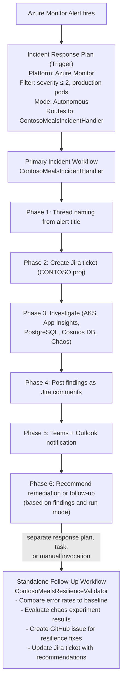
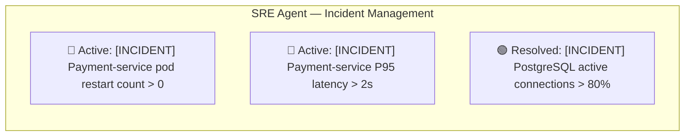
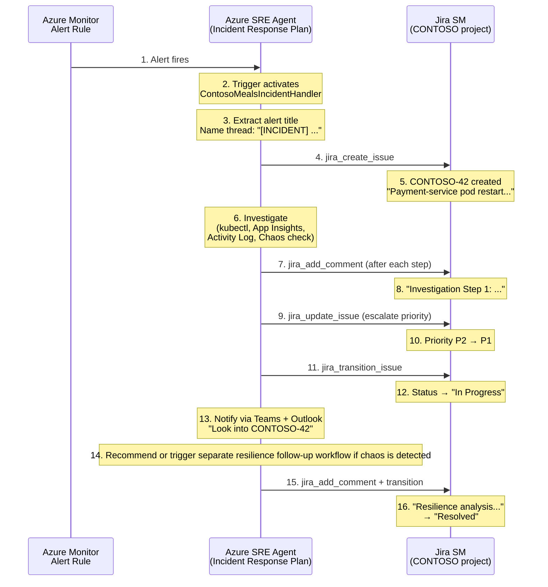

# Incident Response Plan: Automated Alert-to-Jira Pipeline — Research & Implementation Steps

> **Purpose:** Research document for implementing an automated incident response plan in Azure SRE Agent that picks up alerts, names threads based on alert title, creates Jira issues, proactively investigates, adds comments with findings, and notifies the user.
> **Date:** 2026-02-12

---

## 1. Executive Summary

The goal is to configure Azure SRE Agent with an **Incident Response Plan** backed by a **custom subagent** that:

1. **Automatically picks up** Azure Monitor alerts when they fire
2. **Names the investigation thread** based on the alert title (e.g., "Payment-service P95 latency > 2s")
3. **Creates a Jira incident ticket** in the CONTOSO project with severity based on business impact
4. **Proactively investigates** using AKS/Container Apps/App Insights/PostgreSQL diagnostics
5. **Adds comments to the Jira ticket** after each investigation step with findings
6. **Notifies the user** via Teams/Outlook to review the investigation

**Yes, a subagent is needed** — and the GA-friendly architecture should use **response-plan routing plus standalone follow-up workflows** rather than runtime handoff chaining. Here's why and how.

---

## 2. Why We Need a Subagent (Not Just an Incident Trigger)

### What an Incident Response Plan alone gives you

An **Incident Response Plan** (configured in Subagent Builder → Create → Incident Trigger) is a trigger mechanism that:
- Watches for incoming alerts from Azure Monitor, PagerDuty, or ServiceNow
- Filters by incident type, priority, impacted service
- Routes to a designated **response subagent**
- Operates in either **Review** (requires approval) or **Autonomous** mode

The incident trigger alone does NOT contain custom investigation logic, Jira integration instructions, or thread-naming behavior. It simply activates a subagent when conditions match.

### What a Subagent adds

The **subagent** is where all the intelligence lives:
- Custom instructions that define the multi-step investigation workflow
- Tool assignments (Azure MCP tools + Jira MCP tools)
- Knowledge base access (runbooks, escalation procedures)
- Decision rules for when to remediate in-thread, trigger a separate follow-up workflow, or escalate to a human

### Official Pattern: Octopets `pd-azure-resource-error-handler.yaml`

Microsoft's official sample uses exactly this pattern:
1. **Incident Trigger** → watches PagerDuty for incoming incidents
2. **Subagent** (`PDazureresourceerrorhandler`) → contains the 6-phase autonomous workflow:
   - Intake → Diagnostics → Source analysis → GitHub issue → Email → Resolution

We adapt this for our Contoso Meals + Jira use case.

---

## 3. Proposed Architecture: Primary Incident Handler + Follow-Up Workflows

### Why this layout instead of a handoff chain?

A single subagent doing everything (investigate + create Jira + update Jira + notify) can work, but it becomes a monolithic instruction set. A chained multi-subagent flow also adds routing overhead. Based on the Azure SRE Agent team's own [context engineering lessons](https://techcommunity.microsoft.com/blog/appsonazureblog/context-engineering-lessons-from-building-azure-sre-agent/4481200), deeper handoff chains became unreliable. The GA-safe pattern is a broad IncidentHandler for the live incident plus separate follow-up workflows when needed:



### When to use just ONE subagent

If you don't need the post-incident resilience analysis (e.g., simpler environments without Chaos Studio), a single subagent with all phases is sufficient and simpler to maintain.

---

## 4. Step-by-Step Implementation

### Step 1: Prerequisites — Verify Connectors

Before configuring the incident response plan, ensure the following connectors are active in **SRE Agent → Settings → Connectors**:

| Connector | Type | Purpose | Status |
|-----------|------|---------|--------|
| Azure MCP Server | Custom MCP (stdio) | 42+ Azure service tools (AKS, Monitor, App Insights) | Required |
| mcp-atlassian | Custom MCP (HTTP) | 34 Jira tools (create, update, transition, comment, SLA) | Required |
| Microsoft Teams | OAuth | Post investigation summaries to team channel | Required |
| Outlook | OAuth | Send notification emails | Optional |

**Verify configuration:**
```
Azure MCP: npx -y @azure/mcp server start (with AZURE_CLIENT_ID + ManagedIdentityCredential)
mcp-atlassian: https://<mcp-atlassian-fqdn>/mcp (with Authorization: Token <jira-api-token>)
```

### Step 2: Upload Knowledge Base Files

Navigate to **SRE Agent → Settings → Knowledge Base → Upload**:

1. `knowledge/contoso-meals-runbook.md` — Service ownership, SLAs, escalation paths
2. `knowledge/jira-itsm-runbook.md` — Jira ticket creation guidelines, priority mapping, workflow lifecycle

These are already in the repo and ready to upload.

### Step 3: Create Subagent 1 — ContosoMealsIncidentHandler

Navigate to **SRE Agent → Subagent Builder → Create → Subagent**

#### Configuration

| Property | Value |
|----------|-------|
| **Name** | `ContosoMealsIncidentHandler` |
| **Instructions** | *(see YAML below)* |
| **Subagent Description** | `Use as the primary response-plan target for Contoso Meals production incidents. Performs end-to-end investigation, creates and updates Jira tickets with real-time findings, and notifies the team.` |
| **Built-in Tools** | Azure CLI, Log Analytics, Application Insights |
| **MCP Tools** | Azure MCP (all tool groups), mcp-atlassian (Jira tools) |
| **Activation** | Incident response plan |
| **Knowledge Base** | Enable — link to uploaded runbooks |

#### Subagent YAML

> **YAML definition:** [`subagents/contoso-meals-incident-handler.yaml`](../subagents/contoso-meals-incident-handler.yaml)
>
> Paste the contents of that file into the **YAML tab** in Subagent Builder.

### Step 4: Create Subagent 2 — ContosoMealsResilienceValidator (Optional)

Navigate to **SRE Agent → Subagent Builder → Create → Subagent**

| Property | Value |
|----------|-------|
| **Name** | `ContosoMealsResilienceValidator` |
| **Instructions** | *(see below)* |
| **Subagent Description** | `Use this subagent for post-incident resilience analysis when a chaos experiment is detected or completed, or when a resolved incident needs follow-up validation.` |
| **Built-in Tools** | Azure CLI, Log Analytics |
| **MCP Tools** | Azure MCP (AKS, Monitor tools), mcp-atlassian (Jira tools) |
| **Knowledge Base** | Enable |

> **YAML definition:** [`subagents/contoso-meals-resilience-validator.yaml`](../subagents/contoso-meals-resilience-validator.yaml)
>
> Paste the contents of that file into the **YAML tab** in Subagent Builder.

### Step 5: Create the Incident Response Plan (Trigger)

Navigate to **SRE Agent → Subagent Builder → Create → Incident Trigger**

| Field | Value |
|-------|-------|
| **Name** | `Contoso Meals Production Alert Handler` |
| **Platform** | Azure Monitor (connected by default) |
| **Filters** | |
| &nbsp;&nbsp;Severity | Sev 0, Sev 1, Sev 2 (Critical through Warning) |
| &nbsp;&nbsp;Impacted Service | All services in `rg-contoso-meals` |
| **Response Subagent** | `ContosoMealsIncidentHandler` |
| **Processing Mode** | `Autonomous` (or `Review` for demo — lets you watch before agent acts) |
| **Timeout** | 30 minutes |

**What this trigger does:**
- Watches for Azure Monitor alerts fired against resources in `rg-contoso-meals`
- Filters to Sev 0-2 (skips informational Sev 3-4 alerts)
- Activates `ContosoMealsIncidentHandler` subagent with the alert context
- The subagent receives the alert title, severity, affected resource, and timestamp

### Step 6: Test in Playground Before Going Live

1. Navigate to **Subagent Builder → ContosoMealsIncidentHandler → Playground**
2. Click **2 Window View** to see tools + responses side by side
3. Enter test prompt:

```
An Azure Monitor alert fired: "payment-service P95 latency > 2s" with severity Sev 1.
Affected resource: aks-contoso-meals in resource group rg-contoso-meals.
The alert title is "Payment-service pod restart count exceeded threshold".
Investigate and follow your incident response process.
```

4. Verify the agent:
   - Names the thread appropriately
   - Creates a Jira ticket in CONTOSO project
   - Posts investigation comments step by step
   - Sends a Teams notification
    - Recommends a resilience follow-up workflow if chaos is detected

---

## 5. Thread Naming — How It Works

### The mechanism

Azure SRE Agent **automatically** names investigation threads when activated by an incident trigger. The thread title comes from the alert/incident metadata. With the custom instructions above, we explicitly instruct the agent to:

1. Use the format `[INCIDENT] <alert-title>` for thread naming
2. Fall back to `[INCIDENT] <service-name> issue detected` if no title is available

### What the user sees

In the SRE Agent portal under **Incident Management → Incidents**:



### Limitation

Thread naming based on alert title is native behavior for the incident trigger — the agent receives the alert metadata (including `alertRule.name`) and uses it as conversational context. The custom instruction `"name the investigation thread using the alert title"` reinforces this behavior and defines the formatting convention.

---

## 6. Alert → Jira Flow — Complete Data Path



---

## 7. Do We Need the Second Subagent?

### Recommendation: **Yes, for the demo — optional for simple production use**

| Scenario | Single Subagent | Two Subagents |
|----------|----------------|---------------|
| **Simple alert → investigate → Jira → notify** | Sufficient | Overkill |
| **Chaos experiment → investigate → Jira → resilience analysis → GitHub issue** | Instruction bloat, >6 phases | Clean separation of concerns |
| **Demo storytelling** | Simpler, GA-aligned | Shows routing plus separate follow-up workflow |
| **Maintenance** | One YAML to maintain | Two focused YAMLs, easier to evolve independently |
| **Context window efficiency** | All tools loaded, even if unused | Each workflow stays bounded and easier to reason about |

**For the Contoso Meals demo:** Use two subagents, but connect them with response-plan routing or a scheduled follow-up task rather than a runtime handoff. That keeps the demo aligned with the current GA operating model.

**For a real production deployment:** Start with one subagent. Split into two only if the investigation YAML exceeds ~200 lines or you need different tool sets for different phases.

---

## 8. Existing Alert Rules That Will Fire This

The following alerts are already deployed via `infra/modules/monitoring.bicep`:

| Alert Rule | Condition | Fires When |
|-----------|-----------|------------|
| `alert-pod-restart-contoso-meals` | `restartingContainerCount > 0` | Any pod restarts in AKS |
| Payment-service P95 latency alert | P95 > 2s | Payment latency spikes |
| PostgreSQL connections alert | Active connections > 80% | DB connection pressure |
| Cosmos DB 429 alert | Throttled requests > 0 | Cosmos DB throttling |

The **Chaos Studio experiment** (`exp-contoso-meals-payment-incident`) will trigger the pod restart alert, which activates the incident response plan, which triggers the `ContosoMealsIncidentHandler` subagent.

---

## 9. Configuration Checklist

- [ ] **Connectors verified:** Azure MCP, mcp-atlassian, Teams, Outlook all active
- [ ] **Knowledge Base uploaded:** `contoso-meals-runbook.md` + `jira-itsm-runbook.md`
- [ ] **Subagent 1 created:** `ContosoMealsIncidentHandler` with full YAML
- [ ] **Subagent 2 created:** `ContosoMealsResilienceValidator` (optional, for chaos demo)
- [ ] **Incident Trigger created:** `Contoso Meals Production Alert Handler`
  - Platform: Azure Monitor
  - Severity filter: Sev 0-2
  - Response subagent: `ContosoMealsIncidentHandler`
  - Mode: Autonomous (or Review for demo)
- [ ] **Playground tested:** Simulated alert prompt, verified Jira ticket creation + comments
- [ ] **GitHub connected:** Resource mapping for AKS cluster to the `azure-sre` repo
- [ ] **Jira project ready:** CONTOSO project with Incident issue type and workflow

---

## 10. Demo Script — How to Show This

### Setup (pre-demo)
1. Configure all of the above
2. Ensure baseline load test has been running (30+ min of metrics in App Insights)
3. Open browser tabs: SRE Agent chat, Jira CONTOSO board, Azure Monitor alerts

### Live demo flow

**Step 1:** Start the lunch rush load test:
```bash
./scripts/start-lunch-rush.sh --load-only
```

**Step 2:** Start the chaos experiment (payment-service pod kill):
```bash
./scripts/start-lunch-rush.sh --chaos-only
```

**Step 3:** Watch the magic happen:
- Azure Monitor fires pod restart alert (within 1-2 minutes)
- SRE Agent incident trigger activates `ContosoMealsIncidentHandler`
- Agent creates Jira ticket → watch CONTOSO board update live
- Agent posts investigation comments → watch Jira ticket comments appear in real-time
- Agent sends Teams notification → "Look into CONTOSO-42: payment-service pod failures"
- Agent hands off to `ContosoMealsResilienceValidator` → resilience analysis + GitHub issue

**Narrator:** *"The alert fired 90 seconds ago. Without a human touching anything, the SRE Agent has already: created a Jira incident ticket, investigated across AKS, App Insights, and Activity Log, posted 5 investigation comments with quantitative findings, escalated the priority to P1, and sent a Teams message to the on-call team. The on-call engineer opens Jira and finds a complete investigation trail — not 'pod restarting, please investigate.'"*

---

## 11. Key References

| Resource | URL |
|----------|-----|
| Subagent Builder Overview | https://learn.microsoft.com/en-us/azure/sre-agent/subagent-builder-overview |
| Subagent Builder Scenarios | https://learn.microsoft.com/en-us/azure/sre-agent/subagent-builder-scenarios |
| Official Incident Automation Sample | https://github.com/microsoft/sre-agent/blob/main/samples/automation/samples/01-incident-automation-sample.md |
| Configure SRE Agent Guide | https://github.com/microsoft/sre-agent/blob/main/samples/automation/configuration/00-configure-sre-agent.md |
| PD Error Handler Subagent YAML | https://github.com/microsoft/sre-agent/blob/main/samples/automation/subagents/pd-azure-resource-error-handler.yaml |
| Context Engineering Lessons | https://techcommunity.microsoft.com/blog/appsonazureblog/context-engineering-lessons-from-building-azure-sre-agent/4481200 |
| SRE Agent Connectors Docs | https://learn.microsoft.com/en-us/azure/sre-agent/connectors |
| mcp-atlassian GitHub | https://github.com/sooperset/mcp-atlassian |
