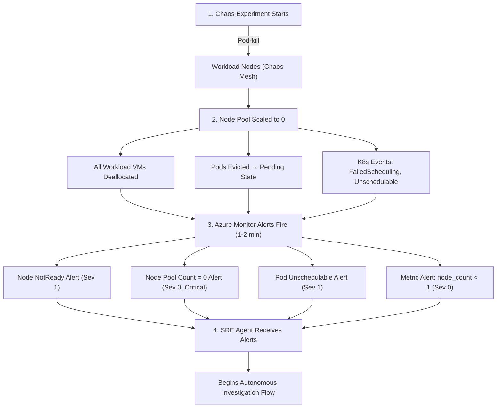

# Node Pool Failure Chaos — SRE Agent Auto-Remediation Proposal

> **Status:** Proposed  
> **Author:** Platform SRE Team  
> **Date:** February 2026  
> **Scenario:** AKS user node pool catastrophic failure → SRE Agent autonomous detection, triage, remediation, and ITSM closure

---

## Executive Summary

This proposal introduces a **node pool failure chaos experiment** for the Contoso Meals platform that simulates the complete loss of the AKS `workload` user node pool. The experiment is designed to validate the Azure SRE Agent's ability to autonomously detect infrastructure-level failures, create incident tickets, perform root cause analysis, execute remediation, and close the ITSM loop — all without human intervention.

Unlike the existing payment-service pod chaos (application-level), this experiment targets **infrastructure-level** failure: the compute substrate itself disappears. This is a more severe and realistic failure mode that tests the SRE Agent's deep infrastructure reasoning capabilities.

---

## Architecture Overview

### Current State
```
AKS Cluster (aks-contoso-meals)
├── system pool (2× Standard_B2s) — system workloads, CoreDNS, etc.
└── (workloads scheduled on system pool)
```

### Proposed State
```
AKS Cluster (aks-contoso-meals)
├── system pool (2× Standard_B2s) — system workloads only
└── workload pool (1× Standard_B2s) — application workloads (order-api, payment-service)
    └── Manual scaling (no autoscaler) — enables chaos testing
```

### Why Manual Scale (Not Autoscaler)?
- **Autoscaler would self-heal** the node pool automatically, preventing the SRE Agent from demonstrating its remediation capabilities
- Manual scaling means the pool stays at 0 until explicitly restored — either by the SRE Agent or a human operator
- This creates a realistic "the infrastructure broke and needs an intelligent response" scenario

---

## Chaos Experiment Design

### Experiment: `exp-contoso-meals-nodepool-failure`

| Property | Value |
|----------|-------|
| **Target** | AKS `workload` user node pool |
| **Mechanism** | Pod-kill via Chaos Mesh + `az aks nodepool scale --node-count 0` |
| **Duration** | Pod chaos: 5 min, Scale-to-0: persistent until restored |
| **Blast Radius** | All pods on workload nodes → Pending state |
| **Recovery** | `az aks nodepool scale --node-count 1` (SRE Agent or manual) |

### Failure Cascade


---

## SRE Agent Expected Behavior

### Phase 1: Detection (T+0 to T+2 min)
- Azure Monitor alert fires via Action Group `ag-contoso-meals-sre`
- SRE Agent receives alert notification
- Agent identifies: node pool failure affecting `production` namespace

### Phase 2: ITSM Ticket Creation (T+2 min)
- Creates P1 Jira ticket in CONTOSO project
  - **Summary:** "AKS workload node pool has 0 ready nodes — application pods unschedulable"
  - **Priority:** P1 (Critical) — complete workload outage
  - **Labels:** `sre-agent`, `aks`, `node-pool`, `production`, `infrastructure`
  - **Description:** Alert details, affected services, blast radius assessment
- Transitions ticket to "In Progress"

### Phase 3: Investigation (T+2 to T+5 min)
The SRE Agent should perform the following investigation steps using Azure MCP tools, posting findings as Jira comments:

1. **Check AKS node pool status**
   ```
   Tool: azure_container_service → get node pool details
   Finding: workload pool has 0/1 nodes ready, provisioningState: Succeeded but count=0
   ```

2. **Check pod status in production namespace**
   ```
   Tool: azure_kubernetes → get pods
   Finding: order-api and payment-service pods in Pending state
   Reason: 0/X nodes are available, X Insufficient cpu, X Insufficient memory
   ```

3. **Check Kubernetes events**
   ```
   Tool: azure_kubernetes → get events
   Finding: FailedScheduling events for order-api and payment-service
   ```

4. **Check Application Insights for error impact**
   ```
   Tool: azure_monitor → query application insights
   Finding: HTTP 503 errors spiking, order success rate dropped to 0%
   ```

5. **Root cause determination**
   ```
   Finding: The 'workload' node pool was scaled to 0 nodes.
   No nodes available for scheduling application pods.
   System pool exists but is reserved for system workloads.
   ```

### Phase 4: Remediation (T+5 to T+8 min)
The SRE Agent should autonomously remediate:

1. **Scale the workload node pool back to 1**
   ```
   Tool: azure_container_service → scale node pool
   Action: az aks nodepool scale -g rg-contoso-meals --cluster-name aks-contoso-meals -n workload --node-count 1
   ```

2. **Post remediation action as Jira comment**
   ```
   "Scaling workload node pool from 0 to 1 node. ETA: 2-3 minutes for node to become Ready."
   ```

### Phase 5: Verification (T+8 to T+12 min)
After remediation, verify recovery:

1. **Confirm node is Ready**
   ```
   Tool: azure_kubernetes → get nodes
   Expected: workload node shows Ready status
   ```

2. **Confirm pods are Running**
   ```
   Tool: azure_kubernetes → get pods
   Expected: order-api and payment-service pods in Running state
   ```

3. **Confirm service health**
   ```
   Tool: azure_monitor → query application insights
   Expected: Error rate returning to baseline, HTTP 200 responses resuming
   ```

### Phase 6: Resolution (T+12 to T+15 min)
1. **Resolve Jira ticket** with summary:
   - Root cause: Workload node pool scaled to 0 nodes
   - Business impact: All order and payment processing down for ~X minutes
   - Remediation: Scaled node pool back to 1 node
   - Recommendation: Add monitoring for node pool scale operations, consider PodDisruptionBudget
2. **Transition ticket to "Done"**
3. **Post final comment** with full incident timeline

---

## Alert Configuration

### Log-Based Alerts (Scheduled Query Rules)

| Alert Name | Query Target | Severity | Evaluation | Window |
|-----------|-------------|----------|------------|--------|
| `alert-node-not-ready-contoso-meals` | KubeNodeInventory (NotReady + workload) | 1 | 1m | 5m |
| `alert-nodepool-zero-contoso-meals` | KubeNodeInventory (workload count = 0) | 1 | 1m | 5m |
| `alert-pod-unschedulable-contoso-meals` | KubeEvents (FailedScheduling) | 1 | 1m | 5m |

### Metric Alert

| Alert Name | Metric | Condition | Severity |
|-----------|--------|-----------|----------|
| `alert-metric-nodepool-count-contoso-meals` | `node_count` (nodepool=workload) | avg < 1 | 0 (Critical) |

All alerts route to → `ag-contoso-meals-sre` Action Group → SRE Agent webhook

---

## Demo Execution Runbook

### Pre-Demo Setup
```bash
# 1. Deploy infrastructure (includes user node pool)
./scripts/deploy.sh

# 2. Set up node pool alerts (post-provision)
./scripts/setup-node-alerts.sh

# 3. Verify node pool is healthy
az aks nodepool show -g rg-contoso-meals \
  --cluster-name aks-contoso-meals -n workload \
  --query '{count:count, provisioningState:provisioningState}'

# 4. Verify pods are on workload nodes
kubectl get pods -n production -o wide
```

### Trigger Chaos
```bash
# Full scenario: load test + chaos experiment + scale node pool to 0
./scripts/start-node-failure.sh

# Chaos + scale only (skip load test)
./scripts/start-node-failure.sh --no-load

# Only chaos experiment (no load, no scale)
./scripts/start-node-failure.sh --chaos-only

# Only scale to 0 (no load, no chaos)
./scripts/start-node-failure.sh --scale-only

# Use a specific load test ID
./scripts/start-node-failure.sh --test-id baseline
```

By default the script starts an Azure Load Testing run (`lunch-rush` test) to generate
traffic before injecting chaos, mirroring the pattern used in `start-lunch-rush.sh`.
This ensures Application Insights has meaningful error-rate and latency data for the
SRE Agent to reference during investigation.

### Monitor the SRE Agent Flow
1. **Azure Portal → SRE Agent chat** — watch the agent receive the alert
2. **Jira CONTOSO board** — ticket appears with investigation updates
3. **AKS node view** — node disappears, then reappears after remediation
4. **kubectl** — `kubectl get pods -n production -w` (watch pods go Pending → Running)
5. **Azure Load Testing** — view live test run metrics alongside the chaos window

### Manual Restore (if SRE Agent doesn't auto-remediate)
```bash
./scripts/start-node-failure.sh --restore
```

---

## Demo Narration Script

### Scene: "Infrastructure Under Fire" (10-15 min)

**[Narrator]** "We've tested application-level failures with pod chaos. Now let's go deeper — what happens when the infrastructure itself disappears?"

**[Action]** Run `./scripts/start-node-failure.sh`

**[Show]** Terminal output showing the load test starting, then chaos injection, then the scale-to-0 operation

**[Narrator]** "We've started a load test to generate realistic customer traffic, then injected chaos, and scaled the workload node pool from 1 to 0 nodes. This is equivalent to a cloud provider zone failure or an accidental node pool deletion during peak traffic. All application pods are now unschedulable — and the load test shows real order failures piling up."

**[Show]** `kubectl get pods -n production` — pods in Pending state

**[Wait 1-2 min for alerts]**

**[Narrator]** "Azure Monitor has detected the failure. Four different alerts have fired — node NotReady, node pool at zero, pods unschedulable, and a critical metric alert. The SRE Agent is now receiving these signals."

**[Show]** SRE Agent chat — agent begins investigation

**[Narrator]** "Watch as the agent creates a P1 Jira ticket, investigates using Azure MCP tools, determines the root cause is a node pool scale-to-zero, and decides to remediate by scaling the pool back."

**[Show]** Jira ticket with real-time investigation comments

**[Wait for remediation ~3-5 min]**

**[Narrator]** "The agent has scaled the workload node pool back to 1 node. Let's watch the pods recover."

**[Show]** `kubectl get pods -n production -w` — pods transition from Pending to Running

**[Narrator]** "The agent has verified the recovery, posted the resolution summary to Jira, and closed the ticket. From detection to resolution — fully autonomous, fully hands-off. The SRE on-call engineer received a clean incident report with root cause, business impact quantified from the load test data, and remediation details — without lifting a finger."

**[Show]** Final Jira ticket with complete incident lifecycle

---

## Files Changed / Created

| File | Action | Description |
|------|--------|-------------|
| [infra/main.bicep](infra/main.bicep) | **Modified** | Added `workload` user node pool (1 node, manual scale) to AKS cluster; added `chaosNodePool` module reference |
| [infra/modules/chaos-node-pool.bicep](infra/modules/chaos-node-pool.bicep) | **Created** | Chaos Studio experiment targeting workload node pool + RBAC roles |
| [scripts/start-node-failure.sh](scripts/start-node-failure.sh) | **Created** | Script to trigger node pool failure (load test + chaos + scale-to-0) and restore |
| [scripts/setup-node-alerts.sh](scripts/setup-node-alerts.sh) | **Created** | Script to create/verify/delete node pool monitoring alerts |
| [docs/node-pool-chaos-proposal.md](docs/node-pool-chaos-proposal.md) | **Created** | This proposal document |

---

## Comparison: Existing Pod Chaos vs. New Node Pool Chaos

| Dimension | Pod Chaos (existing) | Node Pool Chaos (new) |
|-----------|---------------------|----------------------|
| **Failure level** | Application (pod) | Infrastructure (node) |
| **Experiment** | `exp-contoso-meals-payment-incident` | `exp-contoso-meals-nodepool-failure` |
| **Mechanism** | Chaos Mesh pod-kill/network delay | Load test + Chaos Mesh pod-kill + scale node pool to 0 |
| **Blast radius** | Single service (payment-service) | All services on workload nodes |
| **Self-healing** | Kubernetes restarts pods | No — manual scale required |
| **SRE Agent action** | Investigate + report | Investigate + **remediate** + report |
| **Severity** | P2 (degraded) | P1 (complete outage) |
| **Demo value** | Agent as investigator | Agent as autonomous operator |

---

## Risks and Mitigations

| Risk | Mitigation |
|------|-----------|
| SRE Agent doesn't have permission to scale node pool | Agent identity has Contributor role on resource group |
| Alert takes too long to fire | 4 overlapping alerts with 1-min evaluation frequency |
| Node takes too long to provision | Standard_B2s provisions in ~2 min; acceptable for demo |
| System pool also affected | System pool is separate and untouched by chaos |
| Pods don't reschedule after restore | Pods have no nodeSelector constraint — will schedule on any available node |

---

## Success Criteria

- [ ] Node pool scales to 0 within 30 seconds of script execution
- [ ] At least one alert fires within 2 minutes
- [ ] SRE Agent creates Jira ticket within 3 minutes of alert
- [ ] SRE Agent posts investigation findings as Jira comments
- [ ] SRE Agent scales node pool back to 1 (autonomous remediation)
- [ ] Pods recover to Running state within 5 minutes of remediation
- [ ] SRE Agent resolves Jira ticket with complete incident summary
- [ ] Total time from failure to resolution: < 15 minutes
