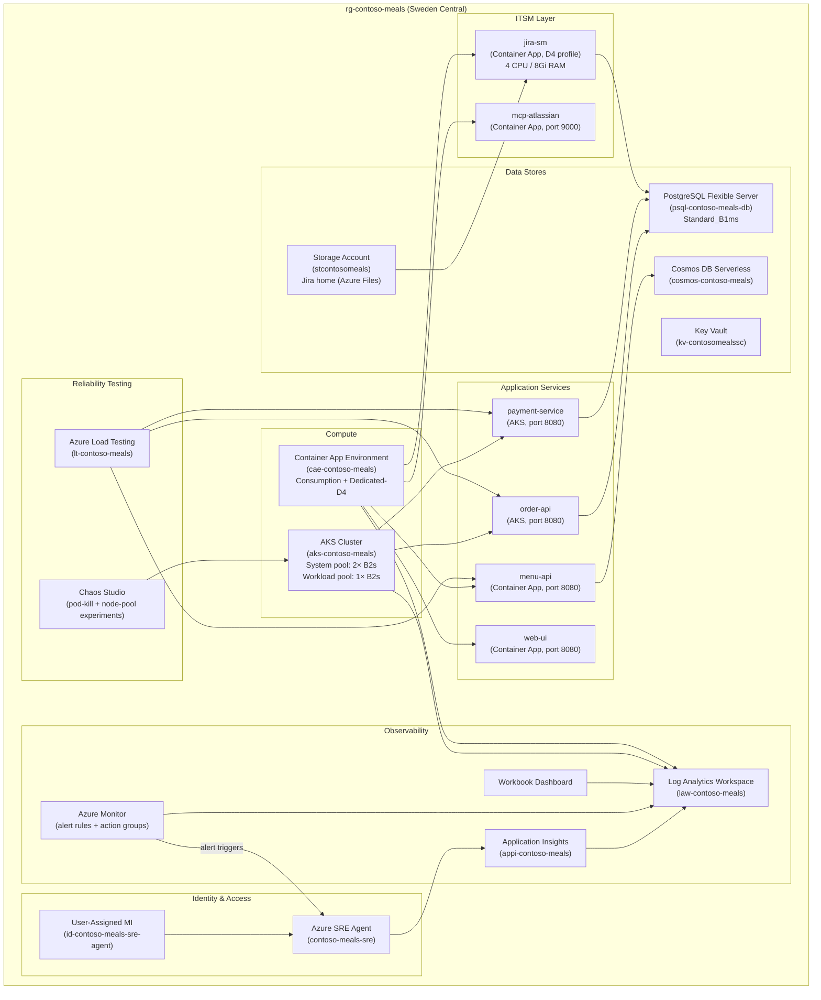
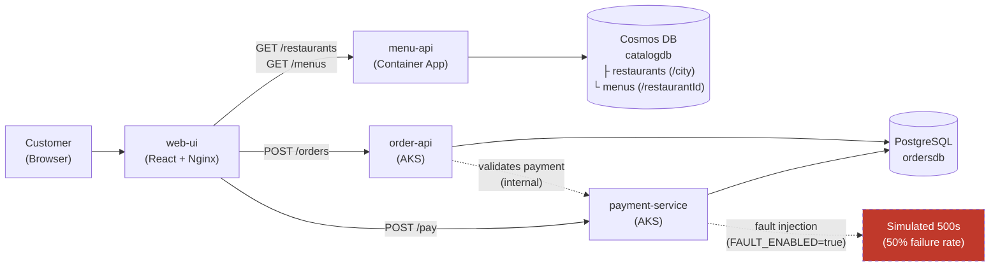
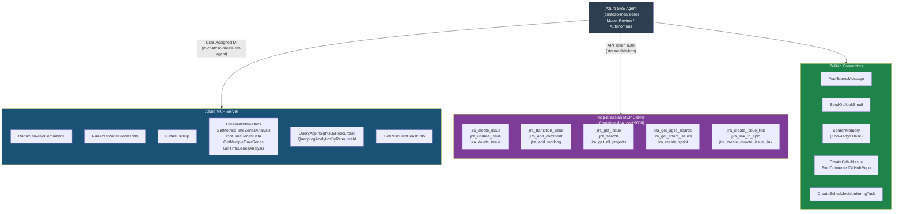
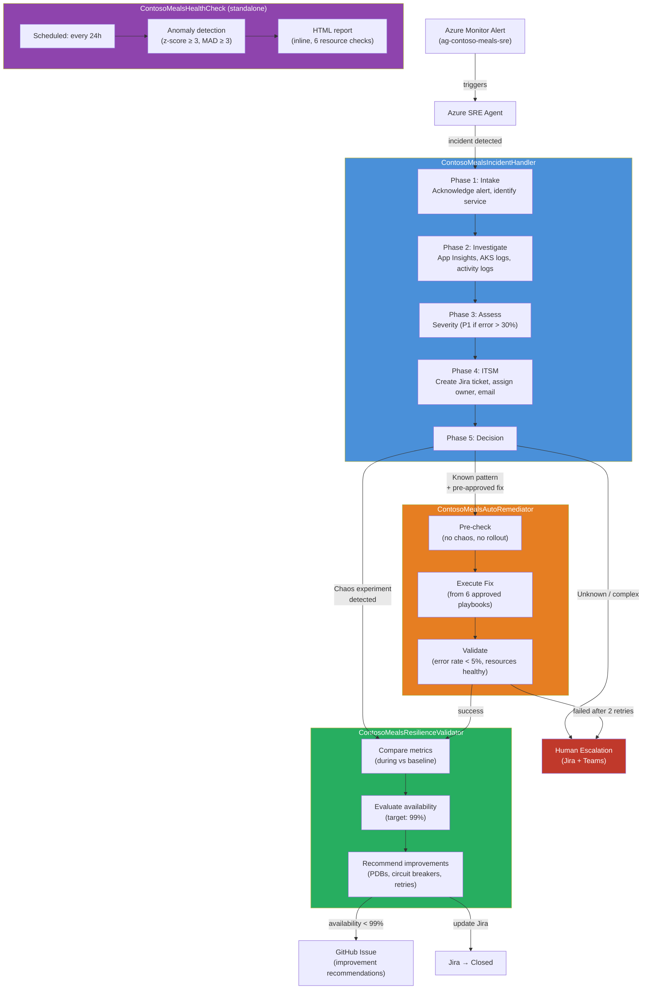
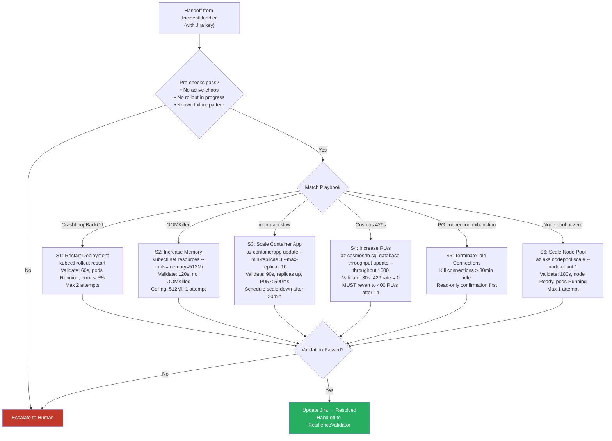
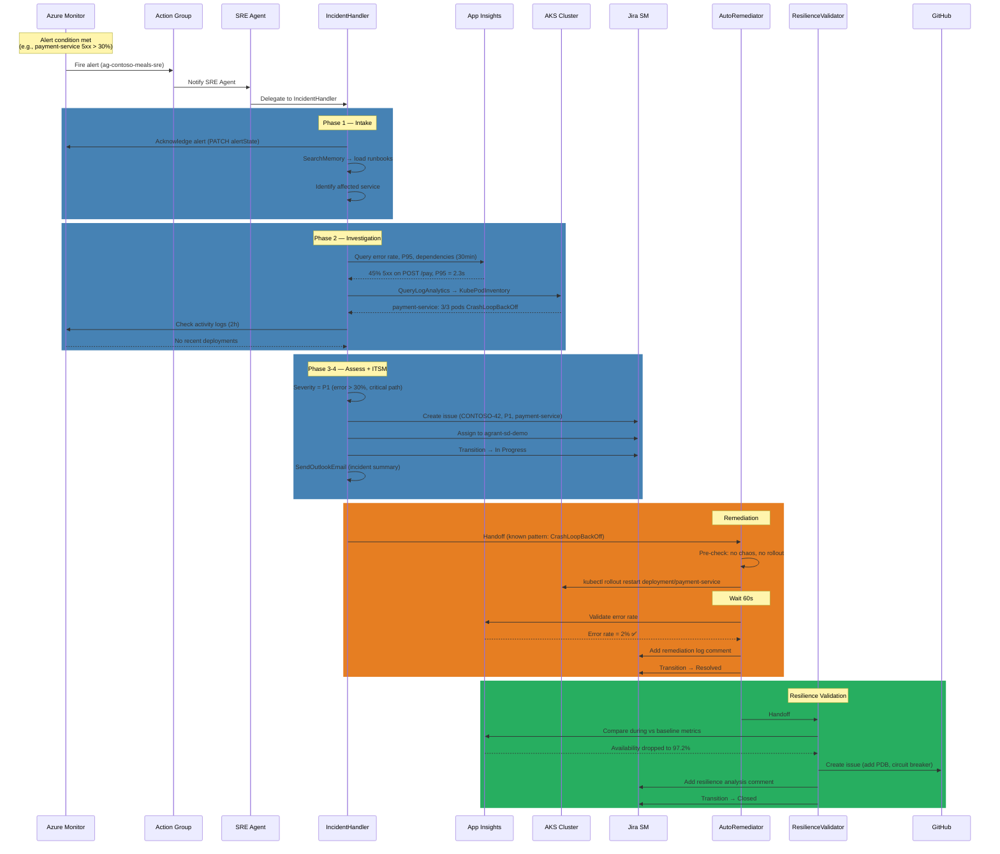
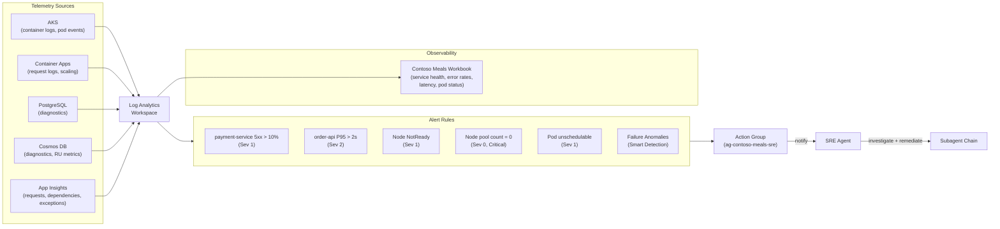
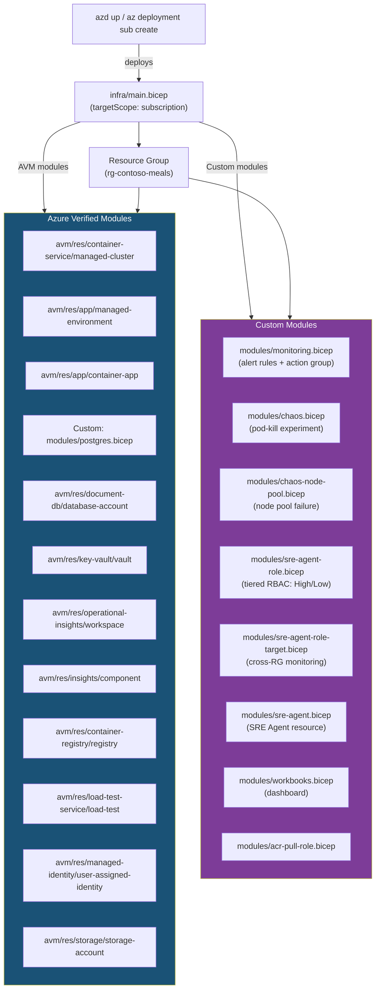

# Contoso Meals — SRE Architecture & Agent Topology

> Comprehensive view of the Azure infrastructure, application services, SRE Agent configuration, and autonomous incident management pipeline for the Contoso Meals platform.

---

## 1. Azure Infrastructure Overview

All resources are deployed into a single resource group (`rg-contoso-meals`) in **Sweden Central** via Bicep with Azure Verified Modules (AVM).

---

## 2. Application Service Communication

| Flow | Protocol | Path | Data Store |
|------|----------|------|------------|
| Browse restaurants | HTTPS | Customer → web-ui → menu-api → Cosmos DB | `catalogdb.restaurants` |
| View menu | HTTPS | Customer → web-ui → menu-api → Cosmos DB | `catalogdb.menus` |
| Place order | HTTPS | Customer → web-ui → order-api → PostgreSQL | `ordersdb` |
| Process payment | HTTPS | Customer → web-ui → payment-service → PostgreSQL | `ordersdb` |
| Fault injection | Internal | payment-service returns 500 when `FAULT_ENABLED=true` | — |

---

## 3. SRE Agent — Tool & Connector Topology

The Azure SRE Agent (`Microsoft.App/agents@2025-05-01-preview`) connects to Azure resources and ITSM systems via MCP servers, and uses built-in connectors for Teams, Outlook, and memory.

### MCP Connector Configuration

| Property | Azure MCP Server | mcp-atlassian |
|----------|-----------------|---------------|
| **Transport** | Streamable HTTP | Streamable HTTP |
| **Identity** | User-Assigned MI (`id-contoso-meals-sre-agent`) | API Token (Jira admin) |
| **Environment** | `AZURE_CLIENT_ID`, `AZURE_TOKEN_CREDENTIALS=ManagedIdentityCredential` | `JIRA_URL`, `JIRA_USERNAME`, `JIRA_API_TOKEN` |
| **Arguments** | `-y, @azure/mcp, server, start` | `--transport streamable-http --stateless --port 9000` |
| **Tool Count** | 42+ | 34 |
| **Scope** | All resources in `rg-contoso-meals` + cross-RG targets | CONTOSO Jira project |

### Knowledge Base

The SRE Agent's memory is seeded with operational runbooks via `SearchMemory`:

| Runbook | File | Contents |
|---------|------|----------|
| Contoso Meals Runbook | `knowledge/contoso-meals-runbook.md` | Service ownership, SLA targets, escalation paths, deployment info |
| Jira ITSM Runbook | `knowledge/jira-itsm-runbook.md` | Project key (CONTOSO), issue types, priority mappings, label conventions, assignee table |

---

## 4. Subagent Hierarchy & Handoff Chain

Four specialized subagents handle distinct phases of the incident lifecycle. The IncidentHandler is the entry point; it delegates to downstream agents based on investigation findings.

### Subagent Tool Matrix

| Tool | IncidentHandler | AutoRemediator | ResilienceValidator | HealthCheck |
|------|:-:|:-:|:-:|:-:|
| `RunAzCliReadCommands` | ✅ | ✅ | ✅ | ✅ |
| `RunAzCliWriteCommands` | ✅ | ✅ | — | — |
| `QueryAppInsightsByResourceId` | ✅ | ✅ | ✅ | ✅ |
| `QueryLogAnalyticsByResourceId` | ✅ | ✅ | ✅ | ✅ |
| `ListAvailableMetrics` | ✅ | ✅ | — | — |
| `PlotTimeSeriesData` | ✅ | ✅ | — | — |
| `GetMetricsTimeSeriesAnalysis` | ✅ | ✅ | — | — |
| `GetMultipleTimeSeries` | — | — | — | ✅ |
| `GetTimeSeriesAnalysis` | — | — | — | ✅ |
| `GetResourceHealthInfo` | — | ✅ | — | — |
| `SearchMemory` | ✅ | ✅ | ✅ | — |
| `PostTeamsMessage` | ✅ | ✅ | — | — |
| `SendOutlookEmail` | ✅ | ✅ | — | ✅ |
| `CreateScheduledMonitoringTask` | — | ✅ | — | — |
| `CreateGithubIssue` | — | — | ✅ | — |
| `FindConnectedGitHubRepo` | — | — | ✅ | — |
| `GetAzCliHelp` | ✅ | ✅ | — | — |
| **Jira MCP tools** | 8 | 32 | 5 | — |

---

## 5. Auto-Remediation Playbooks

The AutoRemediator executes only pre-approved actions with strict safety ceilings.

### Safety Guardrails

| Rule | Ceiling |
|------|---------|
| AKS deployment restarts | `production` namespace only (`payment-service`, `order-api`) |
| Memory limit increase | Max 512Mi per container |
| menu-api replicas | Min 1, max 10 |
| Cosmos DB RU/s | Max 1000 RU/s, must revert after 1h |
| Node pool scaling | Min 0, max 3 nodes |
| **Forbidden** | Delete resources, modify network/NSG/RBAC, scale beyond ceilings, Key Vault changes, actions outside `rg-contoso-meals` |

---

## 6. End-to-End Incident Lifecycle

Complete sequence from alert to incident closure, showing all participants and data flow.

---

## 7. Monitoring & Alerting Pipeline

---

## 8. Deployment Architecture (IaC)

### Post-Deployment Scripts

| Script | Purpose |
|--------|---------|
| `scripts/deploy.sh` | Full automated deployment (Bicep + app build + push + K8s apply) |
| `scripts/post-provision.sh` | Post-Bicep setup (AKS credentials, database init) |
| `scripts/post-deploy.sh` | Post-app-deploy (Container App env var injection) |
| `scripts/seed-data.sh` | Seed Cosmos DB with restaurant/menu data |
| `scripts/setup-jira.sh` | Configure Jira SM (project, users, workflows) |
| `scripts/setup-node-alerts.sh` | Create node pool monitoring alerts |
| `scripts/generate-load.sh` | Generate baseline traffic for monitoring |
| `scripts/start-lunch-rush.sh` | Start chaos load test scenario |
| `scripts/start-node-failure.sh` | Trigger node pool failure chaos experiment |
